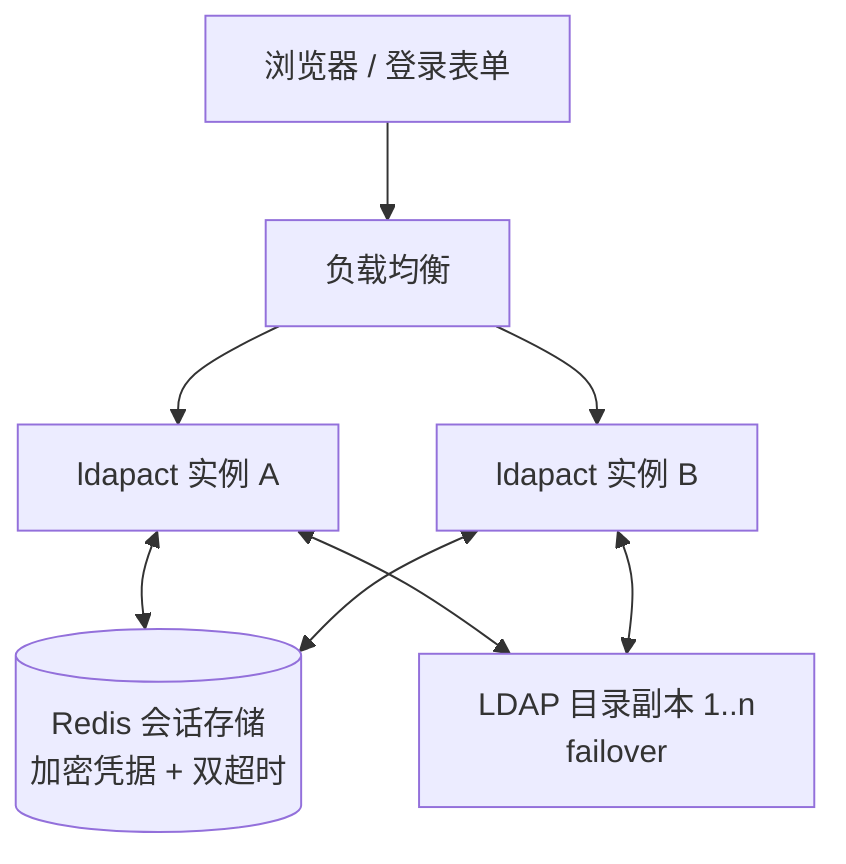

# External Session Store and Login Gate

## Summary

会话层改为共享存储：Redis 为默认后端，bbolt（持久单实例）与 memory（临时单实例/开发）为显式可选后端。新增共享管理员身份登录门禁：bind 密码从配置移入登录流程，LDAP 验证通过后加密存入会话记录。多 server 支持以同目录副本 failover 形式落地（`LDAPADM_SERVERS=url1,url2`）。

---

## Problem Frame

当前会话存储在本地 bbolt 单文件（`pkg/session`），由 `LDAPADM_DB_PATH` 指定路径。单实例下工作正常，但三个实际场景让它成为限制：

- 多实例部署（LB 后多个 ldapact 副本）时，各实例的 session 互不可见——cookie 被路由到另一实例即失效，会话层事实上不可用；F2 向导等服务端状态与审计连续性随之丢失。
- 容器化/临时文件系统部署下，本地文件不可依赖；公司已有 Redis/PG 基础设施，运维希望会话状态纳入统一存储管理。
- bind 密码长期放在配置里（`LDAPADM_BIND_PASSWORD`），任何能读取配置/环境的人都能以管理员身份操作，登录与凭据完全脱节。

同时，多副本 HA 部署需要把多个目录地址交给应用，而当前配置只接受单个 URL。密码一旦移出配置，启动期"以配置密码 fail-fast bind"的行为也必须重新设计。

---

## Architecture

浏览器经 LB 到达任意实例；会话记录存于共享后端，凭据加密、双超时随记录；LDAP 副本由连接池透明 failover。

---

## Actors

- A1. 管理员/运维操作者：通过登录门禁输入 bind DN 与密码，使用 ldapact 执行目录管理操作。
- A2. 平台运维：部署多实例、运行 Redis、管理凭据加密密钥与目录 TLS。
- A3. LDAP 目录：验证登录 bind，执行操作；副本共享同一目录语义。

---

## Key Flows

- F1. 登录（含过期重登）
  - **Trigger:** 无有效会话的请求访问受保护页面，或会话过期后继续操作。
  - **Actors:** A1, A3
  - **Steps:** 展示登录表单（bind DN 预填共享值、可编辑；密码输入）→ 提交 → 对副本列表内可用副本执行 LDAP bind → 成功则创建会话（cookie + 后端记录：server 引用、bind DN、加密凭据、双超时）→ 重定向到树页；失败则返回错误，不创建会话。
  - **Outcome:** 只有通过目录验证的请求获得可用会话；凭据以加密形式进入会话记录。
  - **Covered by:** R5, R6, R9

- F2. 跨实例会话复用
  - **Trigger:** 实例 A 上登录的会话，后续请求被 LB 路由到实例 B。
  - **Actors:** A1, A2, A3
  - **Steps:** B 收到带 cookie 的请求 → 从共享后端读取会话 → 校验双超时 → 解密凭据 → 以该身份执行 LDAP 操作。
  - **Outcome:** 任意实例可继续会话，无需会话亲和性；轮换、过期、登出在任一实例生效。
  - **Covered by:** R2, R14

- F3. 过期与登出
  - **Trigger:** idle/absolute 超时到期，或 A1 主动登出。
  - **Actors:** A1, A2
  - **Steps:** 删除后端会话记录（TTL/惰性删除/主动删除）→ 清空 cookie → 凭据随之不可用 → 下次请求跳转登录页。
  - **Outcome:** 过期或登出后的 cookie 无法再发起 LDAP 操作。
  - **Covered by:** R4, R7, R8

- F4. 副本 failover
  - **Trigger:** 副本列表内当前使用的目录地址不可达。
  - **Actors:** A2, A3
  - **Steps:** 连接池探测到不可达 → 切换到列表内健康副本 → 会话与凭据不受影响，操作继续；全部副本不可达时操作失败并给出明确错误。
  - **Outcome:** 单个副本故障对用户透明；整体不可达时错误清晰可诊断。
  - **Covered by:** R11

---

## Requirements

**存储与后端**
- R1. 会话存储抽象为可配置后端：Redis（默认）、bbolt（持久单实例兼容）、memory（临时单实例/开发），由配置选择。
- R2. Redis 后端：会话记录包含 server 引用、bind DN、加密凭据、创建/最后活动/绝对过期时间；支持跨实例并发读写与状态变更时的原子轮换；过期记录被清理（TTL/惰性删除）。
- R3. bbolt/memory 后端保持既有语义（双超时、轮换、过期清理）；memory 重启即清空；两者仅面向单实例。
- R4. 会话过期或登出后，其中携带的凭据不得再用于 LDAP 操作。

**认证与登录**
- R5. 新增登录门禁：共享管理员身份；bind DN 由配置提供并预填到登录表单、允许编辑；密码由登录者输入，不再来自配置。
- R6. 登录验证以提交的 bind DN + 密码对可用副本执行 LDAP bind；成功后凭据经服务端密钥加密存入会话记录；凭据绝不写入 cookie、日志或页面。
- R7. 新增登出：删除会话记录并清空 cookie。
- R8. 会话过期默认行为为跳转登录页（redirect_to_login）；不再提供 retry_bind（无配置密码可自动重绑）；运行期 bind 返回 invalidCredentials（如目录侧改密）时作废会话并引导重新登录。
- R9. 登录、登出路由受既有安全中间件保护（CSRF、速率限制、安全头、请求 ID）。

**多 server 副本**
- R10. 配置支持副本 URL 列表（`LDAPADM_SERVERS`，[]string 逗号分隔），共享 baseDN/treeFilter/bindDN；不引入按 server 的并行参数列表。
- R11. 连接池在副本间故障转移（可选负载均衡）；副本故障对用户透明，全部不可达时操作与登录给出明确错误。
- R12. 登录表单不提供 server 选择器；副本对用户透明。

**会话安全与多实例**
- R13. 保留既有安全不变量：`__Host-` cookie 属性（Secure/HttpOnly/SameSite=Strict）、CSRF Origin 校验、审计 actor=bind DN、密码/凭据在日志边界红act。
- R14. 多实例正确性：旋转、过期、登出在任意实例生效，无需会话亲和性；所有实例持有同一凭据解密密钥。

**启动与配置**
- R15. 启动不再需要 bind 密码；目录可达性/TLS 探测保留，凭据校验移至首次登录；bind 失败不再作为拒绝启动的条件。
- R16. 配置校验规则：副本列表非空且 URL 合法；未知 `LDAPADM_*` 变量忽略、必填缺失启动失败的既有规则继续适用；存储后端、Redis 连接、凭据加密密钥均有明确配置项（命名与校验由规划确定）。

**兼容与迁移**
- R17. 选择 bbolt 后端时既有 `LDAPADM_DB_PATH` 配置继续有效；不迁移既有会话，切换存储后用户重新登录即可。

---

## Acceptance Examples

- AE1. **Covers R1, R14.** Given 两个实例共享同一 Redis 后端，when 在实例 A 登录后请求经 LB 路由到实例 B，then 会话有效、LDAP 操作成功、无亲和性要求。
- AE2. **Covers R4, R8.** Given 会话 idle 超过默认 30 分钟，when 下一个请求到达，then 会话被判定过期、后端记录失效、请求被重定向到登录页。
- AE3. **Covers R7.** Given 已登录会话，when 用户点击登出，then 后端记录删除、cookie 清空、重放旧 cookie 被拒并跳转登录页。
- AE4. **Covers R10, R11.** Given 副本列表含两个 URL 且主副本宕机，when 后续请求到达，then 自动切换到健康副本、会话与操作不受影响；两个副本均不可达时操作报错且错误可诊断。
- AE5. **Covers R6, R8.** Given 目录侧修改了 bind 密码，when 旧会话发起下一次操作，then bind 失败、会话作废、被引导用新密码重新登录。
- AE6. **Covers R5, R6.** Given 登录提交错误密码，when 请求发送，then 不创建会话、返回错误，且连续失败受速率限制。
- AE7. **Covers R1, R3.** Given 配置选择 memory 后端，when 进程重启，then 全部会话清空、需重新登录；选择 bbolt 后端时重启后会话保留。

---

## Success Criteria

- 多实例部署下会话可共享、可撤销、无需亲和性；任一实例上的登录、轮换、过期、登出行为一致。
- bind 凭据不再出现在配置、cookie、日志或页面；仅以加密形式存在于所选后端。
- 无有效会话的请求被引导登录；错误密码被拒绝且受速率限制。
- 副本故障对用户透明；全部副本不可达时错误清晰。
- 单实例快速试用无外部依赖仍可行（显式选择 bbolt 或 memory）。
- 实现者仅凭本文档即可确定存储抽象边界、配置项、登录/登出/过期行为，无需回访用户。

---

## Scope Boundaries

- PG/memcached 后端——延后，待真实需求。
- 无状态签名 cookie 会话——否决：bind 凭据需共享且可撤销，cookie 无法承载。
- per-user bind 与多租户/公网暴露模型——延后；v1 保持共享身份。
- 不同目录的多 profile 配置与登录页 server 选择器——延后，待不同目录场景出现。
- F2 向导的服务端会话状态行为——延后；会话数据字段可保留但不新增行为。
- 既有 bbolt 会话迁移——不做，会话短生命周期，切换即重登。
- 速率限制、审计、模板引擎等会话层之外的组件行为——保持不变。

---

## Key Decisions

- Redis 默认 + bbolt/memory 可选的三后端抽象：覆盖多实例、单实例持久、开发三种部署形态。
- 服务端共享存储而非无状态 cookie：凭据必须可共享、可撤销，cookie 无法承载（体积与安全均不可行）。
- 共享身份登录门禁而非 per-user bind：v1 最小改动，per-user 延后。
- 凭据加密进会话记录而非密钥管理服务：语义贴合"登录后才知道密码"；加密密钥成为新的运维资产（所有实例共享）。
- 多 server 落地为同目录副本 failover：覆盖"同一目录多副本"这一大概率场景；不同目录 profile 延后。
- 配置仅新增 `LDAPADM_SERVERS` []string，不引入并行参数列表：envconfig 原生支持，避免多列表错位。
- 会话过期默认行为从 retry_bind 翻转为 redirect_to_login：密码不在配置后自动重绑不再可能。
- 启动不再以配置密码 fail-fast bind，凭据校验移至首次登录；目录可达性探测保留。

---

## Dependencies / Assumptions

- 环境已有 Redis（用户确认）；Redis 连接、鉴权与 TLS 配置为规划项。
- 所有实例共享同一凭据加密密钥，经既有 secret 解析（env / 0600 文件）获取。
- LDAP 副本共享同一目录语义（baseDN/treeFilter/bindDN 一致）。
- 会话为短生命周期数据，无需迁移；切换后端即全体重新登录。
- envconfig v1.4.0 原生支持 `[]string` 逗号分隔（已在模块源码中验证）。
- memory 后端仅限单实例；多实例配置需校验或文档明确禁止。
- 目录侧密码轮换会自然导致存量会话失效（见 R8/AE5），属于预期行为。

---

## Outstanding Questions

### Deferred to Planning

- [Affects R2][Technical] Redis 中 idle/absolute 双超时的具体表示与强制校验方式（TTL vs 值内时间戳 + 惰性删除）。
- [Affects R14][Technical] 凭据加密密钥的轮换策略与是否支持双密钥优雅过渡。
- [Affects R1, R16][Technical] 后端选择、Redis 连接、加密密钥的配置项命名与校验规则。
- [Affects R11][Technical] 副本 failover 的探测频率、切换算法与是否做负载均衡。
- [Affects R17][Needs research] bbolt 后端下 `LDAPADM_DB_PATH` 与 secret 解析的既有行为兼容细节。
