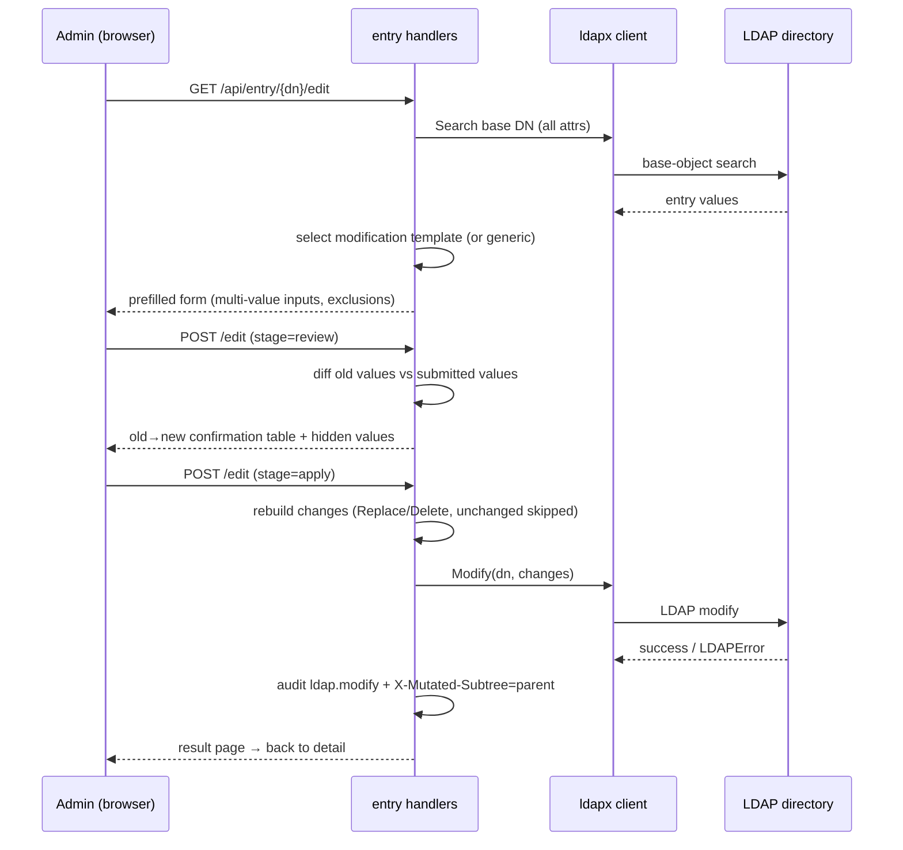
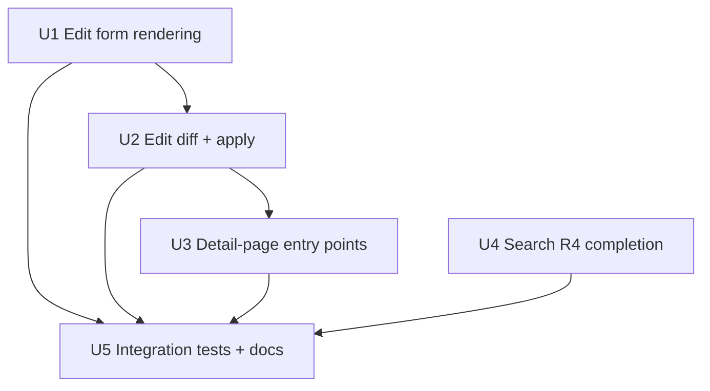

# Complete entry view, edit, and search (v1 gap closure)

## Summary

The v1 implementation shipped without a general entry-edit flow (R3 modify is
only reachable through password change) and with a search surface narrower
than R4 (only subtree/global scopes, fixed DN sort, no limits or attribute
selection). This plan closes those gaps: an edit flow driven by the shipped
but unused `templates/modification/*.xml` corpus (with a generic fallback
editor), detail-page entry points that make F-Detail the edit gateway, and an
R4-complete search surface with base/one/subtree scopes, sortable columns,
and size/time/attribute parameters.

---

## Problem Frame

The v1 parity claim (origin: "同等能力替换") is incomplete in two places an
admin touches daily: editing an existing entry's attributes (telephone, mail,
group membership) requires either LDIF import or the password-only modify
path, and search cannot scope to one level or a single entry, cannot sort, and
cannot constrain result size or time. The modification template corpus shipped
in v1 (`templates/modification/inetOrgPerson.xml`,
`templates/modification/posixGroup.xml`) is dead weight until the edit flow
exists. The PHP oracle (`~/Sites/phpLDAPadmin`) has the reference flow:
`template_engine.php` renders a prefilled modification form,
`update_confirm.php` shows an old→new diff, `update.php` applies the LDAP
modify.

---

## Requirements

- R1. Entry edit (origin R3): edit existing entries via LDAP Modify, driven by
  modification templates when one matches the entry's objectClass, with a
  generic attribute editor as fallback; RDN changes stay in F6 rename.
- R2. Search completeness (origin R4): support base / one / subtree scopes,
  sortable results, pagination, size limit, time limit, and attribute
  selection through the HTTP surface.
- R3. Password isolation (origin R9, R15): `userPassword` is never an editable
  field in the edit flow; F3 owns password changes; no password value appears
  in any audit line.
- R4. Audit parity (origin R15, AE6): every successful edit emits one
  structured log line with `event=ldap.modify`, actor (bind DN), target DN,
  and `op_type=modify`.
- R5. Template behavior preserved (origin R7, R14): modification templates
  parse through the same `tplengine` parser (lazy, schema-canonicalized);
  unknown macros fail at load time; custom templates load from
  `templates_dir`.
- R6. Accessibility (origin R18): new edit/confirm/search surfaces keep
  WCAG 2.1 AA primitives (labels, `role="alert"` errors, `aria-invalid`,
  focus-visible, touch targets).

**Origin actors:** A1 (LDAP admin).
**Origin flows:** F-Detail (entry view gateway), F8 (search), F3 (password —
  kept out of edit), F6 (rename — RDN kept out of edit).
**Origin acceptance examples:** AE6 (audit shape `ldap.modify` with no
  `userPassword` value).

---

## Scope Boundaries

- In scope: modification-template-driven edit form + generic fallback;
  multi-value attribute editing; review-then-apply; detail-page edit entry
  point; search scopes/sort/limits/attribute selection.
- Not in scope: objectClass add/remove through edit (v2 per origin schema
  direction); batch operations (origin deferred); dedicated group-member
  management UI (origin deferred — `memberUid` edits as a multi-value field);
  per-attribute inline editing without a full form; schema filter/search UX
  (origin R5.x defers filtering to v2).

### Deferred to Follow-Up Work

- Server-side sort without a client fallback: shipped as
  sort-control-with-fallback in this plan; a later pass can make sort strict.
- Template-selection preference UI (choose among multiple matching
  modification templates): v1 auto-selects with an explicit `?template=`
  override; a picker UI is follow-up.

### Deferred to Implementation

- How custom `attrs` search columns render in the result table: requested
  attributes become additional columns when `attrs` is present; default
  columns (DN, objectClass, modifyTimestamp) are used otherwise.

---

## Context & Research

### Relevant Code and Patterns

- `pkg/entry/detail.go` + `pkg/web/templates/entry-detail-content.html`:
  F-Detail fetch/render; the edit entry point slots into its actions list.
- `pkg/entry/create.go` + `pkg/entry/handlers.go`: form rendering
  (`CreateFormData`/`FormField`), macro context (auto-number pool, plain
  override, default scheme), schema canonicalization on submit, `audit()`
  helper, `TemplateLoader` (custom dir first, then embedded corpus).
- `pkg/tplengine/parser.go`, `model.go`, `macros_server.go`, `macros_client.go`:
  shared template parser; `PickList`/`MultiList` render picklists;
  `autoFill` emits client JS. Modification templates use the same DTD as
  creation templates and parse unchanged.
- `pkg/ldapx/crud.go` `Modify(ctx, dn, []ldap.Change)` (R3 write surface);
  `pkg/ldapx/search.go` `SearchOptions{Scope, Attrs, SizeLimit, TimeLimit,
  PageSize, AllowEmptyBase}` + `Page` (connection-pinned paging loop).
- `pkg/search/handler.go` + `pkg/web/templates/search-content.html`:
  current subtree/global surface to extend.
- `internal/app/app.go` `entryDispatch`: action suffixes are parsed from the
  last path segment — `edit` fits the existing pattern.
- `pkg/web/templates/form-field.html`: reusable single-value field renderer
  (text/select/textarea/password + error/notice states).
- `templates/modification/inetOrgPerson.xml`, `templates/modification/posixGroup.xml`:
  shipped-but-unused corpus; `posixGroup.xml` exercises `MultiList` for
  `memberUid`.

### Institutional Learnings

- No `docs/solutions/` entries exist; the accepted v1 residuals
  (`docs/residual-review-findings/feat-ldapact-v1.md`) do not cover edit or
  search scope.
- The v1 create flow established the pattern this plan reuses: stateless
  forms (values round-trip through the response), inline `role="alert"`
  errors, `X-Mutated-Subtree` for tree refresh, audit at the handler.

### External References

- PHP oracle `~/Sites/phpLDAPadmin/htdocs/update.php`,
  `update_confirm.php`, `template_engine.php` (read-only): diff → confirm →
  apply; hidden attributes carry state between steps.
- RFC 4511 §4.6 modify operations; RFC 2891 server-side sort control.
- go-ldap v3.4.14 `ControlServerSideSorting`/`SortKey` (present in the pinned
  module) enables server-ordered paging when the directory supports it.

---

## Key Technical Decisions

- **Route shape:** single action suffix `edit` on `/api/entry/{dn...}` — GET
  renders the form; POST carries `stage=review|apply`. Fits the existing
  `entryDispatch` suffix parser; no new ServeMux pattern needed.
- **Template auto-selection:** choose the modification template whose
  objectClass set is a subset of the entry's objectClasses, most specific
  match first; `?template=` overrides; no match falls back to a generic
  editor that renders every non-operational, non-password attribute.
- **Diff strategy:** compare fetched values vs form values per attribute;
  changed single-value attributes → `Replace`; changed multi-value attributes
  → `Replace` with the full new set; cleared attributes → `Delete` with no
  values; unchanged attributes are skipped (no LDAP call when nothing
  changed). RDN attributes render read-only with a "use Rename" hint.
- **Two-step apply with confirm page:** POST `stage=review` renders an
  old→new table (phpLDAPadmin `update_confirm.php` parity); `stage=apply`
  executes. New values travel as hidden inputs (stateless, matching the
  create flow's round-trip pattern) — no session-backed form state.
- **Exclusions:** `userPassword` (link to F3), `objectClass` (read-only),
  operational attributes (explicit exclusion list), and RDN attributes are
  not editable; `userPassword` shows `[redacted]` on the form as on the
  detail page.
- **Multi-value encoding:** repeated form field names (`r.Form[field]` array);
  rendered as one input per existing value with add/remove controls.
  PickList/MultiList-backed fields render as multi-select when the attribute
  is multi-value, single select otherwise.
- **Search scope mapping:** `base` → `ScopeBaseObject`, `one` →
  `ScopeSingleLevel`, `subtree` → `ScopeWholeSubtree`; `global` remains an
  alias for subtree with an empty base (root DSE). Unknown scope → 400.
- **Search sort:** `sort=dn|objectclass|modified` + `dir=asc|desc`; when a
  sort is requested, add a server-side sort control (RFC 2891) to the paged
  search; if the directory rejects it (sort control unsupported or
  `unwillingToPerform`), fall back to per-page client sort and keep the
  response functional. Default remains DN ascending.
- **Search limits/attrs:** `size_limit`, `time_limit`, and `attrs`
  (comma-separated) parameters map directly onto `SearchOptions`
  (`SizeLimit`, `TimeLimit`, `Attrs`) — the LDAP layer already supports them.
- **Audit + refresh:** reuse the existing `audit()` helper →
  `event=ldap.modify`, `op_type=modify`, actor = session `ProfileRef` (bind
  DN); successful edits emit `X-Mutated-Subtree: <parent DN>` so the tree
  refetches the branch (same contract as create/delete/rename).

---

## Open Questions

### Resolved During Planning

- Confirm step: included (PHP parity) as a stateless `stage=review` page
  rather than a session-backed wizard.
- Modify granularity: full-set `Replace` for changed attributes instead of
  per-value add/delete diffs — simpler and always RFC-valid.
- Sort+paging: server-side sort control with per-page fallback, because some
  directories reject the RFC 2696 + RFC 2891 combination.

### Deferred to Implementation

- Exact operational-attribute exclusion list membership (start from
  `modifyTimestamp`, `createTimestamp`, `entryDN`, `entryUUID`,
  `structuralObjectClass`, `hasSubordinates`, `subschemaSubentry`, and refine
  against the test directory).
- Template match scoring details (subset match; tie-break by template order
  or `title`).
- Whether generic-fallback edit should also render template-less
  PickList-style helpers — v1 starts with plain multi-value inputs.

---

## High-Level Technical Design

> *This illustrates the intended approach and is directional guidance for review, not implementation specification. The implementing agent should treat it as context, not code to reproduce.*

Search scope/sort/limit contract (directional):

| query param | values | mapped to |
|---|---|---|
| `scope` | `base` \| `one` \| `subtree` \| `global` | `ScopeBaseObject` \| `ScopeSingleLevel` \| `ScopeWholeSubtree` (global = subtree, empty base) |
| `sort` / `dir` | `dn` \| `objectclass` \| `modified`; `asc` \| `desc` | `SortKey` control; fallback per-page sort |
| `size_limit` / `time_limit` | int seconds | `SearchOptions.SizeLimit` / `TimeLimit` |
| `attrs` | comma-separated | `SearchOptions.Attrs` (default keeps current columns) |

---

## Implementation Units

### U1. Edit form rendering

**Goal:** Render a prefilled edit form for an entry — from the best-matching
modification template, or a generic attribute editor — with multi-value
support and the R9/R15 exclusions.

**Requirements:** R1, R5, R6

**Dependencies:** None (template loader and parser exist; this unit wires them
to a new route)

**Files:**
- Create: `pkg/entry/edit.go` (GET handler, template selection, prefill,
  multi-value field model)
- Modify: `pkg/entry/handlers.go` (`TemplateLoader` gains a modification-corpus
  loader + selection helper)
- Modify: `internal/app/app.go` (`entryDispatch` maps the `edit` action)
- Create: `pkg/web/templates/edit-form-content.html`
- Modify: `pkg/web/templates/form-field.html` (multi-value input group +
  add/remove controls, keeping single-value behavior)
- Test: `pkg/entry/entry_test.go`

**Approach:**
- `TemplateLoader` loads `modification/<name>.xml` (custom `templates_dir`
  first, then embedded) — the modification corpus already parses with the
  shared `tplengine` parser.
- Fetch the entry (base-object search, `*`), canonicalize attribute names via
  the cached schema, and select a template whose objectClass set is a subset
  of the entry's; `?template=` forces a name.
- Render fields: single-value attributes reuse the form-field patterns;
  multi-value attributes render one input per current value plus add/remove
  buttons; PickList/MultiList-backed values render as select(s);
  `userPassword` renders `[redacted]` with a "Change password" link;
  RDN and `objectClass` render read-only; operational attributes are omitted.
- The new `edit` routes are wrapped by the existing session + CSRF
  middleware already applied to every route; no new access-control work is
  needed.
- Keep the flow stateless: the form posts values back; no session state.

**Patterns to follow:**
- `pkg/entry/create.go` `buildFormFields`/`CreateFormData` for field model and
  rendering; `form-field.html` for control markup; `detail.go` for entry
  fetch + `[redacted]` handling.

**Test scenarios:**
- Happy path: `GET /api/entry/cn=alice,.../edit` on an `inetOrgPerson` entry
  renders `givenName`/`sn`/`mail` inputs prefilled with current values and an
  "Edit" submit that posts back to the same URL.
- Happy path: a `posixGroup` entry renders `memberUid` as a multi-value field
  (one input per existing member) and `gidNumber` read-only.
- Edge case: entry whose objectClass matches no modification template →
  generic editor renders all non-operational attributes prefilled.
- Edge case: `?template=posixGroup` forces a template even when another match
  would be chosen.
- Edge case: multi-value attribute with zero current values renders one empty
  input row plus add controls.
- Error path: missing entry → 404 (existing `isNotFound` mapping); template
  parse failure → 500 with a named template error (parser contract).
- Integration: a custom modification template under `templates_dir` renders
  for a matching entry (loader custom-dir-first contract).

**Verification:**
- Edit form renders current values for both template-matched and generic
  entries; unit tests in `pkg/entry` pass; `go vet`/`staticcheck` clean.

---

### U2. Edit diff and apply

**Goal:** Compute the old→new diff, show a confirmation page, apply the LDAP
modify, audit per R15, and refresh the tree.

**Requirements:** R1, R3, R4

**Dependencies:** U1

**Files:**
- Modify: `pkg/entry/edit.go` (POST `stage=review`/`stage=apply`, diff,
  change building)
- Create: `pkg/web/templates/edit-confirm-content.html` (old→new table +
  hidden values)
- Test: `pkg/entry/entry_test.go`

**Approach:**
- `stage=review`: rebuild the same field model as U1, compare each submitted
  value set against the freshly fetched entry, and render a per-attribute
  old→new table; unchanged attributes are marked "unchanged"; new values
  round-trip as hidden inputs.
- `stage=apply`: rebuild changes — `Replace` for changed attributes (full
  value set), `Delete` (no values) for cleared attributes, skip unchanged —
  canonicalize attribute names, then `ldapx.Modify`; zero changes short-
  circuits to "no changes" without an LDAP call.
- On success: `audit(r, "ldap.modify", dn, "modify")`,
  `X-Mutated-Subtree: <parent DN>`, result page linking back to the detail
  view. On LDAP failure: re-render the form with inline `role="alert"` errors
  (same UX contract as create/password).
- `userPassword` never appears in changes, logs, or rendered pages (the
  exclusions from U1 make this structural).

**Patterns to follow:**
- `pkg/entry/password.go` error surfacing (`passwordChangeError`) and
  `pkg/entry/create.go` audit + `X-Mutated-Subtree` + result-page pattern.

**Test scenarios:**
- Happy path: changing `mail` and adding a `telephoneNumber` produces a
  review table with old→new rows; `stage=apply` calls `Modify` with two
  `Replace` changes.
- Happy path: clearing a single-value attribute yields a `Delete` change with
  no values.
- Edge case: submitting the form unchanged yields zero changes and no
  `Modify` call (short-circuit).
- Edge case: multi-value attribute edit removes one value and adds another →
  single `Replace` with the new full set.
- Error path: LDAP rejects with a constraint violation → form re-renders with
  an inline error and submitted values preserved; no audit line emitted.
- Covers AE6: successful edit emits exactly one JSON log line with
  `event=ldap.modify`, `actor=<bind DN>`, `dn=<entry DN>`,
  `op_type=modify`, and the log buffer never contains the submitted password
  or any `userPassword` value.
- Integration: edit an entry against the test LDAP, re-fetch, and assert the
  new values are present.

**Verification:**
- Review/apply round-trip works against a real LDAP backend; audit shape
  matches AE6; zero-change submit performs no LDAP call.

---

### U3. Detail-page edit entry points

**Goal:** Make F-Detail the edit gateway — an "Edit" action, a
`userPassword` row that points at F3, and a template-match hint.

**Requirements:** R1, R3, R6

**Dependencies:** U1, U2

**Files:**
- Modify: `pkg/entry/detail.go` (expose edit link + matched template name in
  `DetailData`)
- Modify: `pkg/web/templates/entry-detail-content.html` (actions list gains
  Edit; password row keeps its F3 link)
- Test: `pkg/entry/entry_test.go`

**Approach:**
- Add an "Edit" action linking to `GET /api/entry/{dn...}/edit`; when a
  modification template matches, show its title as a hint (e.g., "Editing
  with template: Generic: Address Book Entry"); otherwise show "generic
  editor".
- Keep the existing `userPassword` `[redacted]` row and its "Change password"
  action unchanged (F3 owns passwords).

**Test scenarios:**
- Happy path: detail page for an `inetOrgPerson` entry contains an Edit link
  that resolves to a 200 edit form and names the matched template.
- Edge case: detail page for an entry with no matching template still shows
  Edit, labeled as the generic editor.
- Edge case: `userPassword` row still renders `[redacted]` and links to
  `/password`.

**Verification:**
- Detail → edit → review → apply → back to detail is clickable end to end.

---

### U4. Search R4 completion

**Goal:** Complete the search surface: base/one/subtree scopes, sortable
columns, size/time limits, and attribute selection, with the LDAP layer
passing sort controls through the paged search.

**Requirements:** R2, R6

**Dependencies:** None (independent of U1–U3)

**Files:**
- Modify: `pkg/ldapx/search.go` (`SearchOptions` gains sort fields; `pageLoop`
  appends the sort control when requested)
- Modify: `pkg/search/handler.go` (scope mapping, sort/dir, `size_limit`,
  `time_limit`, `attrs` parsing, fallback sort)
- Modify: `pkg/web/templates/search-content.html` (scope options; sortable
  column headers with asc/desc links; keep `aria-invalid` filter errors)
- Test: `pkg/search/handler_test.go`, `pkg/ldapx/search_test.go`

**Approach:**
- Scope: parse `scope=base|one|subtree|global` into the corresponding
  `ldap.Scope*`; unknown → 400; empty → subtree; `global` keeps the existing
  empty-base behavior.
- Sort: `sort` + `dir` params; build a `SortKey` and attach a server-side
  sort control in `pageLoop` alongside paging; on sort-control failure
  (unsupported/unwilling), retry the page without the control and sort the
  returned page client-side; default `dn,asc` stays.
- Limits/attrs: pass `size_limit`/`time_limit`/`attrs` through to
  `SearchOptions`; default columns unchanged when `attrs` is absent.
- UI: scope select gains "Base entry" and "One level" options; table headers
  become links preserving `q`/`scope`/`base`/`page` and toggling
  `sort`/`dir`.

**Patterns to follow:**
- `pkg/ldapx/search.go` `pageLoop` control assembly; `pkg/search/handler.go`
  existing param parsing and filter-error rendering.

**Test scenarios:**
- Happy path: `scope=one` passes `ScopeSingleLevel`; `scope=base` passes
  `ScopeBaseObject`; `global` keeps empty base.
- Happy path: `sort=modified&dir=desc` attaches a `SortKey` control; entries
  render in the requested order.
- Edge case: directory rejects the sort control → handler falls back to
  per-page sort and still returns 200 with sorted rows.
- Edge case: `sort=dn&dir=asc` matches the default; `dir` absent defaults
  `asc`.
- Edge case: `attrs=cn,mail` limits requested attributes.
- Error path: unknown scope → 400; invalid filter keeps the existing inline
  `aria-invalid` message; oversized `page_size` stays capped at 500.
- Integration: one-level search on the seeded tree returns direct children
  only; base search returns the single entry; subtree returns descendants.

**Verification:**
- Scope/sort/limit/attrs all observable in `SearchOptions` via unit tests;
  integration search covers the three scopes against the test LDAP.

---

### U5. Integration tests and docs

**Goal:** Prove the closed loop end to end and update the public docs so no
stale "no edit flow / subtree-only search" claims remain.

**Requirements:** R1, R2, R4

**Dependencies:** U1, U2, U3, U4

**Files:**
- Modify: `test/integration/flows_test.go` (edit + search flow tests)
- Modify: `pkg/entry/integration_test.go` (edit against seeded entries)
- Modify: `README.md` (features, API table rows for edit, search params)
- Modify: `CHANGELOG.md` (unit entries)
- Modify: `OPERATIONS.md` only if the search/edit surface changes an ops
  contract (expected: no change)

**Approach:**
- Extend the F1–F8 harness with an edit flow (detail → edit → review →
  apply → verify via re-fetch) and search scope/sort assertions using the
  seeded tree (10 users, 3 groups, 5 OUs).

**Test scenarios:**
- Integration: edit `mail` + add `telephoneNumber` on a seeded user; re-fetch
  shows both changes; audit line has `ldap.modify`.
- Integration: `scope=one` under `ou=People` returns only direct children;
  `scope=base` on a user DN returns that entry; sort by `modified` desc
  returns the newest first.
- Integration: unchanged edit submit performs no modify (no-op path).

**Verification:**
- `make test` (with an available LDAP backend) green; README/CHANGELOG list
  the new routes and search parameters; no doc references edit as missing.

---

## System-Wide Impact

- **Interaction graph:** new `edit` action flows through `entryDispatch`;
  edit success feeds the existing `X-Mutated-Subtree` tree-refresh contract;
  search handler shares the `Page`/`SearchOptions` path with tree browse and
  export, so `SearchOptions` changes must not alter tree/export behavior when
  sort is unset.
- **Error propagation:** LDAP failures surface as `*ldapx.LDAPError` mapped to
  inline form errors (create/password precedent); template parse failures are
  named load-time errors; missing entries map to 404.
- **State lifecycle risks:** none from form state (stateless review/apply with
  hidden inputs); modify is a single atomic LDAP operation; multi-value
  `Replace` is atomic per attribute.
- **API surface parity:** two new effective actions on the entry route
  (GET/POST `edit`); search params are additive; no existing route changes.
- **Integration coverage:** the U5 harness exercises edit and the three search
  scopes against a real directory; per-unit tests cover the diff/fallback
  logic with fakes.
- **Unchanged invariants:** create flow, password flow, delete, rename, tree,
  export, and import are untouched; `userPassword` remains write-only via F3;
  no new dependencies; the `ldapx` API stays backward-compatible (sort fields
  optional).

---

## Risks & Dependencies

| Risk | Mitigation |
|---|---|
| RFC 2696 paging + RFC 2891 sort rejected by some directories | Sort control attempted first; on failure the search retries without it and sorts the page client-side (U4) |
| `Replace` semantics edge cases (cleared attribute) | Explicit `Delete` with no values for cleared attributes instead of empty `Replace` (U2) |
| Ambiguous template match (multiple modification templates fit) | Subset-of-objectClass selection + `?template=` override; picker UI deferred |
| Generic editor exposes operational/structural attributes to destructive edits | Exclusion list + `objectClass`/RDN read-only (U1); excluded list refined against the test directory during implementation |
| RDN edited through the form by mistake | RDN attributes render read-only with a "use Rename" hint (U1) |
| Edit form grows unwieldy for wide schemas | v1 ships template-driven forms with generic fallback; pagination/steps are follow-up if real directories need them |

---

## Documentation / Operational Notes

- README: Features list gains "Entry edit (modification templates + generic
  editor)"; API table gains `GET/POST /api/entry/{dn...}/edit`; search row
  documents scope/sort/limit/attrs params.
- CHANGELOG: one entry per unit under the new section, marking the v1 gap
  closure.
- No config changes, no new env vars, no deployment surface changes; the
  strict `LDAPADM_*` allowlist is untouched.

---

## Sources & References

- **Origin document:** [docs/brainstorms/ldapact-go-reimplementation.md](../brainstorms/ldapact-go-reimplementation.md)
- **Prior plan:** [docs/plans/2026-08-24-001-feat-ldapact-v1-implementation-plan.md](../plans/2026-08-24-001-feat-ldapact-v1-implementation-plan.md) (U6 F-Detail intent, U7 search intent)
- Related code: `pkg/entry/detail.go`, `pkg/entry/create.go`, `pkg/entry/handlers.go`, `pkg/tplengine/`, `pkg/ldapx/search.go`, `pkg/ldapx/crud.go`, `pkg/search/handler.go`, `templates/modification/*.xml`
- PHP compatibility oracle (read-only): `~/Sites/phpLDAPadmin/htdocs/template_engine.php`, `update_confirm.php`, `update.php`
- External docs: RFC 4511 (modify), RFC 2696 (paging), RFC 2891 (server-side sort), go-ldap v3.4.14 sort-control reference
