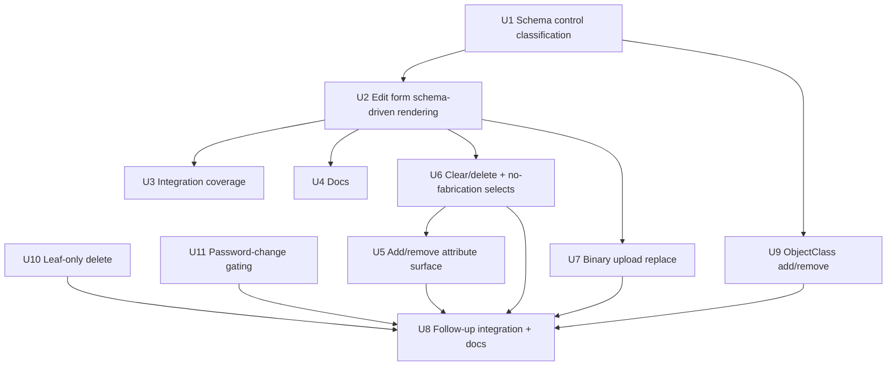

# Schema-driven edit form controls

## Summary

Make the entry edit form render each attribute's control from the LDAP schema
definition instead of heuristics: attributeType syntax decides control kind
(Boolean → TRUE/FALSE select, DN syntax → DN-aware text field, binary syntax →
read-only, multi-line syntax → textarea), SINGLE-VALUE decides single vs
multi-value shape, objectClass MUST decides required markers, and USAGE
decides operational-attribute exclusion. The classification applies on both
the template-driven and generic-fallback edit paths, with template-declared
presentation (e.g. textarea, picklists) preserved wherever it does not
conflict with schema semantics.

---

## Problem Frame

The edit flow shipped in the entry edit/search plan renders controls
heuristically: template-driven fields use the XML template's declared type or
PickList/MultiList macros, and the generic fallback editor renders every
non-operational, non-password, non-RDN attribute as a plain text input. The
LDAP subschema — already parsed and cached in `pkg/ldapx` — is consulted only
for single-vs-multi value and canonical names. The phpLDAPadmin oracle derives
control type from the attributeType (AttributeFactory: boolean → TRUE/FALSE
select, binary → BinaryAttribute, DN → DnAttribute, multi-line → textarea,
else plain text). The result today: booleans are edited as free text, binary
values (e.g. `userCertificate`) can be corrupted by text round-trips,
multi-line values (e.g. `postalAddress`) render in single-line inputs, MUST
attributes carry no signal, and operational-attribute exclusion relies on a
hardcoded name list instead of the schema's USAGE declaration.

---

## Requirements

- R1. Control kind per attributeType syntax on both edit paths: Boolean →
  TRUE/FALSE select; binary syntaxes (Binary / Certificate / CertificateList /
  CertificatePair / JPEG) → read-only; DN syntaxes (Distinguished Name, Name
  And Optional UID) → DN-aware text field with hint; multi-line syntax (Postal
  Address) → textarea; everything else → text.
- R2. Single-value vs multi-value form shape comes from schema SINGLE-VALUE on
  both paths (template MultiList still forces multi).
- R3. Required markers from the entry's effective objectClass MUST set
  (resolved through SUP); informational only — no hard submission block.
- R4. Operational attributes excluded via schema USAGE
  (`directoryOperation` / `distributedOperation` / `dSAOperation`), retaining
  the hardcoded list as fallback for schema-unknown names.
- R5. Template compatibility preserved: template-declared presentation
  (`type=textarea`, PickList/MultiList selects, display names) remains when it
  does not contradict schema semantics; schema semantics win on conflict
  (binary / boolean / single-value / USAGE).
- R6. WCAG 2.1 AA primitives preserved for new controls and markers (labels,
  visible required text, focus, touch targets).
- R7. Public docs updated so README/CHANGELOG describe schema-driven control
  rendering.
- R8. Add-attribute: the edit form offers an "Add attribute" entry listing the
  entry's effective objectClass MUST/MAY attributes (SUP-resolved) that are
  not already present, and the added attribute renders with the same
  schema-driven control classification and round-trips through review/apply.
- R9. Delete/clear: every editable attribute can be cleared or removed through
  the form — single-value by emptying the input, multi-value by removing all
  rows, boolean by choosing "(not set)", or via an explicit per-attribute
  "Delete attribute" action; an empty submitted value set produces a Delete
  change (multi-value remove-all must not fall back to the entry's values).
  **Schema-MUST attributes are excluded: they cannot be deleted or cleared**
  (server-enforced — a Delete targeting a required attribute that currently
  has a value is rejected with an inline error and no LDAP call). MAY and
  schema-unknown attributes are freely deletable.
- R10. Binary replace: binary-syntax attributes keep their read-only value
  display and gain a file-upload control; an uploaded file replaces the
  attribute's value set through the review → apply flow (upload stashed
  server-side between steps, size-capped, temp files cleaned up after apply).
- R11. No-fabrication selects: single- and multi-value select fields always
  include an empty "(not set)" option so an untouched submit cannot silently
  create a value by browser-defaulting to the first option.
- R12. ObjectClass add/remove through the edit form, with the following rules
  (server-enforced): STRUCTURAL objectClasses are never removable (and never
  addable — an entry keeps exactly one structural chain); AUXILIARY
  objectClasses can be added (any schema auxiliary class not already present);
  an objectClass is removable only when it is AUXILIARY **and** no attribute
  value on the entry depends exclusively on it — i.e. none of its effective
  attributes (MUST ∪ MAY through SUP, minus the union of the entry's other
  objectClasses' effective sets) currently hold values; ABSTRACT classes are
  neither addable nor removable. ObjectClass changes flow through review →
  apply as a full-set Replace like any other attribute.
- R13. Leaf-only deletion: an entry that has children cannot be deleted —
  the delete confirmation shows the child count and blocks deletion (no
  recursive delete, no typed-DN bypass); children must be removed first.
- R14. Password-change gating: the "Change password" affordance (detail-page
  action, edit-form password row, and the `/password` route itself) is only
  available when the entry actually has a `userPassword` attribute.

**Origin actors:** A1 (LDAP admin).
**Origin flows:** F-Detail (edit gateway), F3 (password — unchanged).
**Origin acceptance examples:** none new (AE6 audit shape untouched).

---

## Scope Boundaries

- In scope: schema-driven control classification and rendering for GET/POST
  entry edit (both template and generic paths); required markers; schema-USAGE
  operational exclusion; add-attribute from the entry's objectClass schema;
  delete/clear semantics for single/multi/boolean attributes; binary replace
  via file upload; no-fabrication select options; unit + integration tests;
  docs.
- Not in scope: creation form controls (F2); DN picker / browse button;
  boolean checkbox style; password flow (F3); rename/move (F6); search;
  schema browser; JSON API.

### Deferred to Follow-Up Work

- DN browse picker (phpLDAPadmin DnAttribute parity): future iteration.
- Per-value binary upload (multi-value binary attributes replaced by a single
  uploaded file in v1; per-value uploads are follow-up).
- Create-flow select no-fabrication parity (the create form has the same
  browser-default-fabrication behavior on untouched selects): follow-up.
- Applying schema-driven control kinds to the creation form: future iteration
  (this plan touches only the edit flow).
- Integer/number input type for Integer syntax: kept as text to match the
  oracle; revisit if form validation becomes a priority.

---

## Context & Research

### Relevant Code and Patterns

- `pkg/entry/edit.go`: `editFieldModel`
  (id/display/kind/multi/readonly/redacted/options/values/hint),
  `templateEditFields` + `genericEditFields`, `attrMultiValue`, `toFormField`;
  edit-form template `pkg/web/templates/form-field.html` branches (Redacted /
  Multi / select / textarea / password / text).
- `pkg/ldapx/schema.go` + `schema_parse.go`: `AttributeType{Syntax,
  SingleValue, Usage, Names}`, `ObjectClass{Must, May, Sup}`; helpers
  `Attribute` / `ObjectClass` / `CanonicalAttribute`; `ParseSchema` consumes
  the subschema subentry.
- `pkg/ldapx/schema_test.go`: `sampleSchemaEntry` fixture style for building
  schema objects in unit tests.
- `pkg/entry/entry_test.go`: `fakeClient` (search/modify fns, `schema` field),
  `testHandler`, edit form tests (`TestEditFormInetOrgPerson`,
  `TestEditFormGenericFallback`, `TestEditReviewAndApply`).
- `pkg/entry/integration_test.go` `TestIntegrationEditEntry` and
  `test/integration/flows_test.go`: real-LDAP round trip;
  `internal/testldap` OpenLDAP harness (core/cosine/inetorgperson/nis
  schemas).
- `internal/app/app.go` `entryDispatch` `case "edit"`: no route changes
  needed; session/CSRF middleware already wraps all routes.

### Institutional Learnings

- `docs/solutions/` has no entries.
- Accepted residuals from the edit/search review
  (`docs/residual-review-findings/feat-entry-edit-search.md`) do not conflict:
  strict server-side sort, per-request size limits, and the HTML-form surface
  are unrelated to control rendering.

### External References

- PHP oracle (read-only): `~/Sites/phpLDAPadmin/lib/AttributeFactory.php`
  factory dispatch; `~/Sites/phpLDAPadmin/lib/ds_ldap.php`
  `isAttrBoolean` / `isDNAttr` / `isAttrBinary` / `isJpegPhoto`;
  `~/Sites/phpLDAPadmin/lib/ds_ldap_pla.php` `isMultiLineAttr`; multi-line
  defaults in `~/Sites/phpLDAPadmin/lib/config_default.php`.
- RFC 4517 syntax OIDs (Boolean .7, Distinguished Name .12, Name And Optional
  UID .34, Binary .5, Certificate .8, CertificateList .9, CertificatePair .10,
  JPEG .28, Postal Address .41, Octet String .40).

---

## Key Technical Decisions

- **Classification lives in `pkg/ldapx`:** the syntax→control mapping,
  USAGE-based operational check, and SUP-resolved MUST/MAY helpers are schema
  domain knowledge; they belong next to `AttributeType` / `ObjectClass` and
  are unit-testable without HTTP. The entry package consumes them.
- **Schema semantics authoritative; template presentation preserved:** the
  generic path is fully schema-driven. In the template path, template
  `type=textarea` and PickList/MultiList selects remain (curated
  presentation, compatible with the DTD), but schema-determined binary
  read-only, boolean select, single-value shape, required markers, and
  operational exclusion always win. Rationale: keeps R7 XML-template
  compatibility (origin) while making schema the source of truth for attribute
  semantics.
- **Required markers informational; MUST deletion forbidden:** visible
  "Required (schema)" text, no HTML `required` attribute, and changing a MUST
  attribute's value is never blocked. Deleting/clearing a MUST attribute,
  however, is forbidden server-side (R9/U6) — the LDAP server would reject it
  anyway, and the form should not offer an action that cannot succeed. A
  broken entry missing a MUST attribute can still be repaired by adding it.
- **Boolean select with "(not set)" option when empty:** current value is
  matched case-insensitively; when the entry has no value, the select includes
  an empty "(not set)" option so an untouched submit yields zero changes
  instead of fabricating `FALSE`.
- **Operational exclusion = schema USAGE + retained hardcoded safety list:**
  many directories omit USAGE or hide attributes (AD behavior noted in the
  oracle); the existing hardcoded map stays as a fallback for schema-unknown
  names.
- **DN fields render as text + hint in v1:** no DN picker (deferred); the LDAP
  server validates on modify. Hint text states "Distinguished Name".
- **Unknown syntax or nil schema → current behavior:** attributes whose syntax
  is not classified, or a nil schema (tests), fall back to text with the
  existing exclusions — no regression on partial-schema directories.

---

## Open Questions

### Resolved During Planning

- Template vs schema precedence: schema semantics authoritative, template
  presentation preserved (see Key Technical Decisions).
- MUST enforcement: informational markers only.
- Add-attribute entry point: out of scope (user-confirmed).
- Select fabrication: resolved — every select field gains an always-available
  "(not set)" option (extends the boolean-only decision; the deferred question
  about other select-backed fields is answered "yes" because untouched submits
  would otherwise fabricate a value).

### Deferred to Implementation

- Exact binary/multi-line OID set refinement against the test directory (start
  from the oracle list; adjust if OpenLDAP exposes additional syntaxes).
- Exact rendering placement/wording of the required marker in `form-field.html`.
- Upload stash cleanup for abandoned review pages (temp files deleted on
  apply; a TTL sweep for orphaned uploads is follow-up).

---

## High-Level Technical Design

> *This illustrates the intended approach and is directional guidance for
> review, not implementation specification. The implementing agent should
> treat it as context, not code to reproduce.*

Control classification matrix (schema attributeType syntax → edit control):

| Syntax (RFC 4517 `.121.1.x`) | Control |
|---|---|
| .7 Boolean | select TRUE/FALSE (+ "(not set)" when no current value) |
| .12 Distinguished Name, .34 Name And Optional UID | text input + "Distinguished Name" hint |
| .5 Binary, .8 Certificate, .9 CertificateList, .10 CertificatePair, .28 JPEG | read-only `[binary]` (jpegPhoto keeps preview) |
| .41 Postal Address | textarea |
| everything else / unknown / nil schema | text (existing behavior) |

Rendering pipeline (directional):

```
fetch entry → select template (or generic) → for each editable attribute:
  schema lookup (canonical name)
  kind = classify(syntax)            // select | readonly | textarea | text
  multi = !SingleValue || template MultiList
  required = effectiveMUST(objectClasses).contains(name)   // marker only
  operational = Usage != userApplications → skip
  template presentation applies only when kind == "text"
→ FormField → form-field.html branches (Redacted / Multi / select / textarea / text)
```

---

## Implementation Units



### U1. Schema control classification

**Goal:** Add schema-derived control-kind classification, USAGE-based
operational detection, and SUP-resolved MUST/MAY sets to `pkg/ldapx`, with
unit tests.

**Requirements:** R1, R2, R3, R4

**Dependencies:** None

**Files:**
- Modify: `pkg/ldapx/schema.go` (or new `pkg/ldapx/schema_controls.go`)
- Test: `pkg/ldapx/schema_test.go`

**Approach:**
- Define RFC 4517 syntax OID constants for the classified set (Boolean,
  Distinguished Name, Name And Optional UID, Binary, Certificate,
  CertificateList, CertificatePair, JPEG, Postal Address).
- Add a classifier (e.g. a method on `Schema`) returning a control kind
  (`select` / `readonly` / `textarea` / `text`) plus an "unknown" signal,
  driven by `AttributeType.Syntax`; unknown → `text`.
- Add `IsOperational(name)`: true when the attributeType's `Usage` is set and
  not `userApplications`; schema-unknown → false.
- Add MUST/MAY resolution helpers: for a list of objectClasses, walk `Sup` to
  compute the effective union of MUST and MAY (canonical names), following the
  existing `ObjectClass` SUP parsing.
- Keep everything backward-compatible: no changes to existing callers
  (`CanonicalAttribute`, `Attribute`, `ObjectClass`).

**Patterns to follow:**
- `ParseSchema` / `atByAnyName` lookup style; `schema_test.go`
  `sampleSchemaEntry` fixture.

**Test scenarios:**
- Happy path: Boolean syntax attr → `select`; Distinguished Name and Name And
  Optional UID → DN-kind text; Binary / Certificate / CertificateList /
  CertificatePair / JPEG → `readonly`; Postal Address → `textarea`; Directory
  String → `text`.
- Edge case: schema-unknown attribute name → `text` with unknown=true;
  attributeType without SYNTAX → `text`.
- Edge case: `IsOperational` true for `directoryOperation`,
  `distributedOperation`, `dSAOperation`; false for `userApplications` and
  schema-unknown names.
- Edge case: MUST/MAY resolution across SUP chains — e.g. a fixture where
  `inetOrgPerson` SUP `organizationalPerson` SUP `person` yields `sn` in MUST
  and `mail` / `postalAddress` in MAY; duplicates from multiple classes are
  deduplicated.
- Error path: objectClass list containing an unknown class name → resolution
  skips it without failing (best-effort union).

**Verification:**
- Unit tests in `pkg/ldapx` pass; `go vet` / `staticcheck` clean; existing
  `ldapx` tests unaffected.

---

### U2. Edit form schema-driven rendering

**Goal:** Wire the classification into both edit paths so controls,
multi-value shape, required markers, and operational exclusion follow the
schema, while preserving template presentation that does not conflict.

**Requirements:** R1–R6

**Dependencies:** U1

**Files:**
- Modify: `pkg/entry/edit.go`
- Modify: `pkg/web/templates/form-field.html`
- Test: `pkg/entry/entry_test.go`

**Approach:**
- In `buildEditModel`, after template selection, resolve each attribute's
  canonical schema type once and classify its kind: template-declared
  `textarea` and macro-backed selects are kept only when the schema kind is
  `text`; schema kinds `select` / `readonly` always win.
- Boolean fields: kind `select`, options TRUE/FALSE, current value matched
  case-insensitively; when the entry has no value, add an empty "(not set)"
  option; single-value form per SINGLE-VALUE.
- DN fields: kind `text` + hint "Distinguished Name" (wired to
  `aria-describedby`).
- Binary fields: `readonly` + `[binary]` values (existing presentation);
  jpegPhoto/photo keep the preview path; drop per-attribute binary hardcoding
  in favor of the classifier.
- Required markers: `FormField` gains a required-by-schema flag;
  `form-field.html` renders a visible "Required (schema)" text (not the HTML
  `required` attribute); RDN/readonly required fields still show the marker
  without blocking.
- Operational exclusion: `Schema.IsOperational` becomes the primary source,
  with the hardcoded map retained as fallback for schema-unknown names.
- Keep the stateless review/apply round trip, hidden template field, and
  `userPassword` / `objectClass` exclusions unchanged.

**Patterns to follow:**
- `editFieldModel` / `toFormField` conversion; `form-field.html` branch
  structure; `mergeOptions` for keeping current values selectable;
  `pkg/entry/create.go` `FormField` extension precedent (edit-flow extensions
  already added there).

**Test scenarios:**
- Happy path: generic editor renders a Boolean-syntax attribute as a select
  with TRUE/FALSE and the current value selected; a DN-syntax attribute as
  text with a "Distinguished Name" hint; a Binary/Certificate-syntax attribute
  read-only `[binary]`; Postal Address as textarea.
- Happy path: inetOrgPerson entry marks `sn` "Required (schema)" (MUST via
  SUP) while `mail` is unmarked; RDN `cn` stays read-only with its existing
  hint.
- Edge case: boolean with no current value shows "(not set)"; an unchanged
  submit produces zero changes (no fabricated value).
- Edge case: boolean current value `"true"` (lowercase) selects `TRUE`.
- Edge case: template `type=textarea` on a string attribute still renders
  textarea; template cannot make a binary attribute editable; PickList-backed
  select is preserved; a template-listed operational attribute (e.g.
  `modifyTimestamp`) is excluded.
- Edge case: schema-unknown attribute renders as text and is not excluded;
  nil schema (fake client without schema) falls back to current behavior
  without panicking.

**Verification:**
- All existing edit tests plus the new ones pass; GET edit form for seeded
  entries shows schema-correct controls; review/apply round trip unchanged.

---

### U3. Integration coverage

**Goal:** Prove schema-driven controls end to end against the real LDAP
harness and guard the edit flow from regression.

**Requirements:** R1, R2, R3, R6

**Dependencies:** U2

**Files:**
- Modify: `pkg/entry/integration_test.go`
- Modify: `test/integration/flows_test.go`

**Approach:**
- Extend the seeded inetOrgPerson entry with a `postalAddress` value (core
  schema) and assert the edit form renders it as a textarea prefilled, then
  modify it through review → apply and re-fetch to confirm.
- Assert the `sn` required marker on the seeded user's edit form (person
  MUST).
- Keep boolean rendering at unit level: no non-operational Boolean attribute
  exists in the harness schemas, and adding custom schema to the test LDAP is
  out of scope for this plan.
- Re-run the existing detail → edit → review → apply flow to prove no
  regression.

**Test scenarios:**
- Integration: seeded user edit form contains a `postalAddress` textarea
  prefilled with the current value and a visible "Required (schema)" marker on
  `sn`.
- Integration: changing `postalAddress` through review → apply persists;
  re-fetch shows the new value; audit line shape unchanged.
- Integration: unchanged submit still short-circuits (no Modify call).
- Integration: the existing edit round-trip flow (detail → edit → review →
  apply) remains green.

**Verification:**
- `make test` with an LDAP backend green; no audit-log or tree-refresh
  regressions.

---

### U4. Docs

**Goal:** Update public docs so README/CHANGELOG describe schema-driven edit
controls accurately.

**Requirements:** R7

**Dependencies:** U2

**Files:**
- Modify: `README.md`
- Modify: `CHANGELOG.md`

**Approach:**
- README Features bullet for edit attributes: note controls are rendered per
  the LDAP schema (syntax-driven kinds, single/multi value, schema-MUST
  markers, operational exclusion), with template presentation preserved.
- README API row for `GET/POST /api/entry/{dn...}/edit`: surface unchanged,
  add a brief note about schema-driven rendering.
- CHANGELOG: one entry per unit under a new section.

**Test expectation:** none — docs only.

**Verification:**
- README/CHANGELOG mention schema-driven control rendering; no stale
  "plain text inputs" claims remain.

---

### U5. Add/remove attribute surface

**Goal:** Give the edit form an "Add attribute" picker fed by the entry's
effective objectClass MUST/MAY set (minus attributes already active) and an
explicit per-attribute "Delete attribute" action, both round-tripping through
review/apply.

**Requirements:** R8, R9, R11

**Dependencies:** U6 (clear semantics + select empty options)

**Files:**
- Modify: `pkg/entry/edit.go`
- Modify: `pkg/web/templates/edit-form-content.html`
- Modify: `pkg/web/templates/form-field.html`
- Modify: `static/js/edit-multi.js` (delete-attribute clearing)
- Test: `pkg/entry/entry_test.go`

**Approach:**
- Candidate set: `EffectiveMust ∪ EffectiveMay` (already SUP-resolved in
  `pkg/ldapx`) minus (entry attributes ∪ template attributes ∪ already-added
  attributes ∪ exclusions: `userPassword`, `objectClass`, operational
  attributes, schema-unknown names). Rendered as a select + "Add attribute"
  button posting `add_attr=<name>`.
- On POST, an `add_attr` name is validated against the candidate set and the
  attribute is rendered as an editable field (schema-driven kind, single/multi
  shape, empty values); it then round-trips through review/apply like any
  other field (review page's hidden inputs already carry all editable fields).
- "Delete attribute" per editable field clears that field's inputs (JS,
  mirroring `edit-multi.js`); without JS the user clears values manually.
  The cleared field submits an empty set → Delete change (U6 semantics).
- The "Delete attribute" action and clear affordances apply to MAY and
  schema-unknown attributes only; schema-MUST attributes render without them
  and are protected by the U6 MUST-delete guard.

**Patterns to follow:**
- `requiredAttrs`/`EffectiveMay` for the candidate set; `applySchemaControl`
  for the added field's control; `edit-multi.js` add/remove-row pattern.

**Test scenarios:**
- Happy path: edit form lists a MAY attribute absent from the entry; adding it
  renders the field prefilled empty, review shows old→new, apply creates the
  value (integration in U8).
- Happy path: MUST attributes missing from a broken entry appear in the
  candidate list (repair path).
- Edge case: already-present, template-listed, operational, `userPassword`,
  `objectClass`, and schema-unknown names are absent from the candidate list.
- Edge case: a crafted `add_attr` outside the candidate set is rejected (no
  arbitrary attribute injection).
- Edge case: an added multi-value attribute renders one empty row; an added
  boolean renders the select with "(not set)" selected.
- Edge case: adding an attribute but leaving it empty produces zero changes
  (no fabricated empty attribute).

**Verification:**
- Add/review/apply round trip creates the attribute; delete/clear produces a
  Delete change; candidate filtering unit tests pass.

---

### U6. Clear/delete semantics + no-fabrication selects

**Goal:** Fix the diff semantics so every attribute can be cleared — multi-value
remove-all must delete, booleans can be cleared, and untouched selects never
fabricate a value.

**Requirements:** R9, R11

**Dependencies:** U1, U2

**Files:**
- Modify: `pkg/entry/edit.go`
- Test: `pkg/entry/entry_test.go`

**Approach:**
- `fieldValues`: when a POST round-trip is in flight and the field name is
  absent from the submitted form (all rows removed, or no hidden input on
  apply), return an empty set — do not fall back to the entry's values.
- `booleanOptions` / `mergeOptions`: include the empty "(not set)" option for
  MAY (and schema-unknown) fields always (clear affordance + no-fabrication
  default), but for schema-MUST fields only when the entry has no current
  value (fabrication protection without a clear affordance).
- MUST-delete guard: `EditSubmit` validates the change set before both review
  and apply — a `Delete` (empty new value set) on a schema-required field
  whose entry currently has values is rejected with an inline
  "required by schema — cannot be cleared" error and no LDAP call; a required
  field that is already absent (broken entry) can be left empty (no-op).
- Empty submitted sets continue to produce `Delete` changes via `buildChanges`.

**Patterns to follow:**
- Existing `cleanValues`/`buildChanges`; `booleanOptions` pattern extended to
  `mergeOptions`.

**Test scenarios:**
- Happy path: single-value clear → Delete change (existing behavior kept).
- Happy path: multi-value remove-all (field absent from POST) → Delete change
  and `Modify` is called (regression for the proven bug).
- Happy path: boolean with a current value renders "(not set)" and choosing it
  clears the attribute (Delete).
- Edge case: clearing a MUST attribute (single-value empty, multi-value
  remove-all, or boolean select) is rejected with an inline error and no
  `Modify` call.
- Edge case: a required select with a current value has no "(not set)" option;
  a required select without a value does (no fabrication), and leaving it
  untouched yields zero changes.
- Edge case: a required field that is already absent from a broken entry can
  be submitted empty (no-op, not an error).
- Edge case: untouched single-value select with no current value submits
  nothing (empty option default), producing zero changes — no fabricated value.
- Edge case: multi-value select rows with values keep them; an empty row
  selects "(not set)" and is dropped.
- Edge case: unchanged canonical-boolean submit still yields zero changes.

**Verification:**
- The proof scenario (remove-all rows → attribute deleted) passes; existing
  edit tests stay green.

---

### U7. Binary upload replace

**Goal:** Let binary-syntax attributes be replaced by an uploaded file through
the review → apply flow, keeping the read-only value display and photo
previews.

**Requirements:** R10

**Dependencies:** U2 (edit flow; U6 empty-set semantics not required for
replace)

**Files:**
- Modify: `pkg/entry/edit.go`
- Modify: `pkg/web/templates/form-field.html`
- Modify: `pkg/web/templates/edit-form-content.html`
- Modify: `pkg/web/templates/edit-confirm-content.html`
- Test: `pkg/entry/entry_test.go`, `pkg/entry/integration_test.go`

**Approach:**
- Binary fields render the existing read-only value (or photo preview) plus a
  single `<input type="file" name="binfile_<attr>">`; the edit form switches
  to `enctype="multipart/form-data"`.
- On `stage=review`: an uploaded file for a binary attribute is read
  (size-capped), written to a per-run temp file keyed by a random token, and
  the review page carries `<input type="hidden" name="bintok_<attr>">`; the
  review row shows "will replace with uploaded file (N bytes)".
- On `stage=apply`: the token resolves to the stashed bytes and builds a
  `Replace` change with the raw value; temp files are removed after apply
  (success or failure). Invalid/expired tokens re-render the form with an
  inline error (upload must be re-selected).
- Attribute-name validation: only schema-classified binary attributes accept
  uploads; multi-value binary attributes are replaced by the single uploaded
  file (per-value upload deferred).
- `jpegPhoto` keeps its preview; an upload replaces the stored image.

**Patterns to follow:**
- `photoBytes`/`maxPhotoBytes` for byte handling; existing inline error
  re-render pattern; stateless round trip extended only by the opaque token.

**Test scenarios:**
- Happy path: uploading a file for a binary attribute renders a review row
  naming the upload; apply replaces the value; re-fetch returns the new bytes
  (integration with `jpegPhoto`).
- Edge case: no file selected → no upload, attribute untouched, zero changes.
- Edge case: file exceeding the size cap → inline error, no stash written.
- Edge case: apply with a missing/invalid token → inline error, no Modify.
- Edge case: crafted `binfile_`/`bintok_` for a non-binary attribute is
  ignored (no arbitrary file writes).
- Integration: replace alice's `jpegPhoto` via upload and re-fetch the new
  image bytes.

**Verification:**
- Unit stash round trip + integration upload round trip pass; temp files are
  removed after apply.

---

### U9. ObjectClass add/remove

**Goal:** Make the entry's objectClass set editable with the structural /
auxiliary / has-values rules, diffed and applied through the existing
review → apply flow.

**Requirements:** R12

**Dependencies:** U1 (schema classification), U2 (edit flow)

**Files:**
- Modify: `pkg/ldapx/schema_controls.go` (`AuxiliaryClasses`,
  `ClassAttributes` helpers)
- Test: `pkg/ldapx/schema_test.go`
- Modify: `pkg/entry/edit.go` (objectClass model, add/remove validation,
  change building; objectClass no longer excluded from diff/apply)
- Modify: `pkg/web/templates/edit-form-content.html` (objectClass section:
  current classes with remove controls for removable auxiliaries + an
  auxiliary "Add object class" picker)
- Modify: `pkg/web/templates/edit-confirm-content.html` (objectClass diff row
  + hidden round trip)
- Test: `pkg/entry/entry_test.go`, `pkg/entry/integration_test.go`

**Approach:**
- `pkg/ldapx` gains `AuxiliaryClasses()` (sorted auxiliary class names from
  the schema) and `ClassAttributes(name)` (effective MUST ∪ MAY through SUP,
  deduplicated) — the latter drives the "has values" check.
- The objectClass field model changes from read-only text to a dedicated
  section: current classes listed, each removable auxiliary (no contributing
  values) with a "Remove" button; an "Add object class" select lists schema
  auxiliary classes not already present.
- `add_oc=<name>` / `remove_oc=<name>` are validated server-side and applied
  to the model immediately (stateless re-render, other field values preserved
  via the submitted round trip); on review/apply the new class set travels as
  hidden `objectClass` inputs and produces a full-set Replace diff when
  changed.
- Validation (both the incremental add/remove and the apply round trip):
  additions must be schema AUXILIARY and not already present; removals must be
  present, AUXILIARY, and have no effective attribute values on the entry;
  STRUCTURAL/ABSTRACT classes can never be added or removed; crafted
  submissions are rejected with inline errors and no LDAP call.
- `buildChanges`/`renderEditConfirm` stop skipping `objectClass`: an empty new
  set is impossible (structural chain stays), so the Replace always carries
  the full set.

**Patterns to follow:**
- `effectiveAttrs` SUP walk for `ClassAttributes`; the U5 add-attribute
  validation pattern; the review-page hidden round trip.

**Test scenarios:**
- Happy path: adding an AUXILIARY class from the picker re-renders the form
  with it listed; review shows old→new classes; apply issues one Replace and
  the class persists (integration in U8).
- Happy path: removing a value-less AUXILIARY class flows through review →
  apply and the class is gone on re-fetch.
- Edge case: STRUCTURAL classes are absent from both the add picker and the
  remove controls; ABSTRACT classes too.
- Edge case: an AUXILIARY class whose effective attributes have values on the
  entry is not removable (e.g. `posixAccount` on a user with `uidNumber`).
- Edge case: crafted `add_oc` naming a structural/unknown class, or
  `remove_oc` naming a structural/abstract/with-values class, is rejected
  with an inline error and no LDAP call.
- Edge case: removing a class and then leaving the form untouched re-renders
  consistently (stateless round trip).

**Verification:**
- Add/remove unit tests + an integration add/remove round trip pass; the
  objectClass diff appears on the review page; `make test` green.

---

### U10. Leaf-only delete

**Goal:** Enforce that entries with children cannot be deleted — delete is
leaf-only.

**Requirements:** R13

**Dependencies:** None (delete flow is independent of the edit-form units)

**Files:**
- Modify: `pkg/entry/delete.go`
- Modify: `pkg/web/templates/delete-confirm-content.html`
- Test: `pkg/entry/entry_test.go`, `pkg/entry/integration_test.go`,
  `test/integration/flows_test.go`

**Approach:**
- `DeleteForm`/`DeleteSubmit`: when the entry has children (`childCount > 0`),
  render the confirmation page in a blocked state — child count shown, no
  delete actions, message that children must be deleted first; `Delete` is
  never called.
- Remove the recursive-delete path (`recursiveDelete`, `MaxRecursiveDelete`,
  depth sorters) and the typed-DN bypass for non-leaf entries; leaf deletion
  keeps its existing confirmation contract.
- Update the delete confirmation template to drop the recursive checkbox and
  the typed-DN input when blocked (or entirely, since non-leaf delete is now
  impossible).

**Patterns to follow:**
- Existing `childCount` search; confirmation-page error/notice rendering.

**Test scenarios:**
- Happy path: leaf entry delete still works (no children → Delete called).
- Edge case: entry with children renders the blocked state with the child
  count and `Delete` is not called, regardless of `recursive`/`confirm_dn`
  values (no bypass).
- Edge case: a crafted POST for a non-leaf entry with `recursive=1` is still
  blocked.
- Integration: F5 flow (leaf delete) stays green; a non-leaf delete attempt
  returns the blocked page.

**Verification:**
- Delete unit tests updated and passing; non-leaf delete is blocked end to
  end; `make test` green.

---

### U11. Password-change gating

**Goal:** Surface the password-change affordance only when the entry has a
`userPassword` attribute.

**Requirements:** R14

**Dependencies:** None

**Files:**
- Modify: `pkg/entry/detail.go` (`DetailData` gains `HasPassword`)
- Modify: `pkg/web/templates/entry-detail-content.html` (conditional action)
- Modify: `pkg/entry/password.go` (`PasswordForm`/`PasswordChange` gate on
  `userPassword` presence)
- Test: `pkg/entry/entry_test.go`

**Approach:**
- `DetailData` gains `HasPassword` (set when the entry has ≥1 userPassword
  value); the detail-page actions list renders "Change password" only then.
- `PasswordForm` returns the not-found/message state when the entry has no
  `userPassword`; `PasswordChange` rejects with the same state before any
  modify.
- The edit form's password row is already gated (only rendered when
  `userPassword` exists) — no change needed there.

**Patterns to follow:**
- `currentScheme` entry fetch; existing `dnError`/not-found handling.

**Test scenarios:**
- Happy path: detail page for an entry with `userPassword` shows the Change
  password action (existing behavior kept).
- Edge case: detail page for an entry without `userPassword` hides the
  action.
- Edge case: direct `GET /password` and `POST /password` for an entry without
  `userPassword` are rejected (no modify attempted).
- Edge case: an entry with an empty-valued `userPassword` counts as absent.

**Verification:**
- Detail rendering + password-route gating tests pass; F3 flow for entries
  with passwords stays green.

---

### U8. Follow-up integration + docs

**Goal:** Prove the new surfaces end to end against the real LDAP harness and
update the public docs.

**Requirements:** R7, R8, R9, R10, R11

**Dependencies:** U5, U6, U7

**Files:**
- Modify: `pkg/entry/integration_test.go`
- Modify: `test/integration/flows_test.go`
- Modify: `README.md`
- Modify: `CHANGELOG.md`

**Approach:**
- Package-level integration: add a MAY attribute to bob via the add-attribute
  flow and verify persistence; clear a single-value attribute and verify
  deletion; replace alice's `jpegPhoto` via upload and verify new bytes.
- Flows harness: assert the add-attribute picker renders on a seeded user's
  generic-editor form (a non-inetOrgPerson entry, e.g. a posixGroup) and that
  the "(not set)" option exists on multi-value rows.
- README Features/API rows + CHANGELOG entries for add/delete/binary/select
  fixes.

**Test scenarios:**
- Integration: add `postalCode` (organizationalPerson MAY) to bob via the
  form; review → apply; re-fetch shows it; clearing `postalAddress` deletes
  it.
- Integration: replace alice's `jpegPhoto` via file upload; re-fetch returns
  the uploaded bytes.
- Integration: existing edit round trips stay green.

**Verification:**
- `make test` with an LDAP backend green; README/CHANGELOG cover the new
  edit-form capabilities.

---

## System-Wide Impact

- **Interaction graph:** classification helpers live in `pkg/ldapx` and are
  consumed only by the edit flow in v1; the create flow shares `FormField` but
  only edit sets the new required/kind semantics, so create rendering is
  untouched.
- **Error propagation:** no new failure paths — schema lookups are best-effort
  (nil schema and unknown names fall back to current behavior); template parse
  errors keep the existing named-error contract.
- **State lifecycle risks:** none — the form stays stateless; the boolean
  "(not set)" case is the only diff-sensitive change and is covered by an
  unchanged-submit test.
- **API surface parity:** no route, query, or response contract changes;
  search/tree/export unaffected.
- **Integration coverage:** U3 exercises textarea + required markers against a
  real directory; boolean/binary/DN rendering is unit-covered with schema
  fixtures.
- **Unchanged invariants:** creation, password, rename, delete, search, tree,
  and LDIF flows untouched; `userPassword` remains write-only via F3; no new
  dependencies; the `ldapx` API stays backward-compatible.
- **New edit surfaces:** add-attribute candidates come from the schema
  MUST/MAY sets and are validated server-side; binary uploads are size-capped,
  token-scoped temp files cleaned after apply; the form becomes
  `multipart/form-data` (field parsing unchanged); create-flow rendering is
  unaffected by the select "(not set)" change (edit-only option assembly).

---

## Risks & Dependencies

| Risk | Mitigation |
|------|------------|
| Boolean "(not set)" diff fabricates a value on untouched submit | Empty option + unchanged-submit test asserting zero changes |
| Template compatibility regression (e.g. textarea lost) | Schema wins only on conflict; existing template tests (`TestEditFormInetOrgPerson`, `TestEditFormPosixGroupMultiValue`) guard |
| Partial/omitted schema (AD-style) excludes or misclassifies attributes | Unknown names fall back to text; hardcoded exclusion map retained as fallback |
| Required markers confuse or block clearing MUST values | Informational markers only, no HTML `required`; documented decision |
| Binary attrs corrupted by text round-trip | Binary syntax → read-only in both paths, existing `[binary]` presentation |
| Multi-value remove-all silently no-ops (proven bug) | U6 `fieldValues` POST semantics + explicit regression test |
| Untouched selects fabricate the first option (proven bug class) | U6 always-present "(not set)" option on every select; zero-change tests |
| MUST attribute cleared through the form (schema violation) | U6 MUST-delete guard rejects before any LDAP call; MAY-only delete UI in U5 |
| Upload stash: orphaned temp files or token replay | Random opaque token, per-attribute name validation, cleanup on apply; TTL sweep deferred |
| Add-attribute injection of operational/unknown attributes | Server-side candidate-set validation (R8) |

---

## Documentation / Operational Notes

- README Features + API table updated (U4); CHANGELOG entries per unit.
- README/CHANGELOG updated again for add/delete/binary/select-fix surfaces
  (U8).
- No config changes, no new env vars, no deployment surface changes; the
  strict `LDAPADM_*` allowlist is untouched.
- No operational rollout notes; behavior change is confined to the edit form
  surface.

---

## Sources & References

- **Origin document:**
  [docs/brainstorms/ldapact-go-reimplementation.md](../brainstorms/ldapact-go-reimplementation.md)
  (R5 schema, R7 XML templates, R14 lazy parse/canonicalize, R18 WCAG)
- **Prior plan:**
  [docs/plans/2026-08-26-003-feat-entry-edit-search-plan.md](../plans/2026-08-26-003-feat-entry-edit-search-plan.md)
  (U1 edit form; completed)
- Related code: `pkg/entry/edit.go`, `pkg/ldapx/schema.go`,
  `pkg/ldapx/schema_parse.go`, `pkg/web/templates/form-field.html`,
  `pkg/entry/entry_test.go`, `pkg/entry/integration_test.go`
- PHP oracle (read-only): `~/Sites/phpLDAPadmin/lib/AttributeFactory.php`,
  `~/Sites/phpLDAPadmin/lib/ds_ldap.php`,
  `~/Sites/phpLDAPadmin/lib/ds_ldap_pla.php`,
  `~/Sites/phpLDAPadmin/lib/config_default.php`
- External docs: RFC 4517 (attribute syntax OIDs), RFC 4512 (attributeType
  USAGE)
