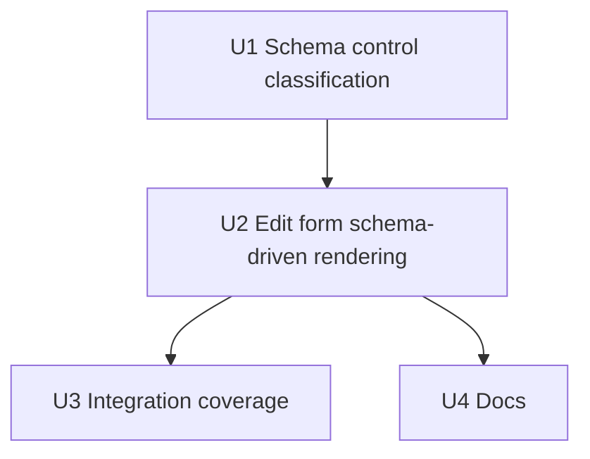

# Schema-driven edit form controls

## Summary

Make the entry edit form render each attribute's control from the LDAP schema
definition instead of heuristics: attributeType syntax decides control kind
(Boolean → TRUE/FALSE select, DN syntax → DN-aware text field, binary syntax →
read-only, multi-line syntax → textarea), SINGLE-VALUE decides single vs
multi-value shape, objectClass MUST decides required markers, and USAGE
decides operational-attribute exclusion. The classification applies on both
the template-driven and generic-fallback edit paths, with template-declared
presentation (e.g. textarea, picklists) preserved wherever it does not
conflict with schema semantics.

---

## Problem Frame

The edit flow shipped in the entry edit/search plan renders controls
heuristically: template-driven fields use the XML template's declared type or
PickList/MultiList macros, and the generic fallback editor renders every
non-operational, non-password, non-RDN attribute as a plain text input. The
LDAP subschema — already parsed and cached in `pkg/ldapx` — is consulted only
for single-vs-multi value and canonical names. The phpLDAPadmin oracle derives
control type from the attributeType (AttributeFactory: boolean → TRUE/FALSE
select, binary → BinaryAttribute, DN → DnAttribute, multi-line → textarea,
else plain text). The result today: booleans are edited as free text, binary
values (e.g. `userCertificate`) can be corrupted by text round-trips,
multi-line values (e.g. `postalAddress`) render in single-line inputs, MUST
attributes carry no signal, and operational-attribute exclusion relies on a
hardcoded name list instead of the schema's USAGE declaration.

---

## Requirements

- R1. Control kind per attributeType syntax on both edit paths: Boolean →
  TRUE/FALSE select; binary syntaxes (Binary / Certificate / CertificateList /
  CertificatePair / JPEG) → read-only; DN syntaxes (Distinguished Name, Name
  And Optional UID) → DN-aware text field with hint; multi-line syntax (Postal
  Address) → textarea; everything else → text.
- R2. Single-value vs multi-value form shape comes from schema SINGLE-VALUE on
  both paths (template MultiList still forces multi).
- R3. Required markers from the entry's effective objectClass MUST set
  (resolved through SUP); informational only — no hard submission block.
- R4. Operational attributes excluded via schema USAGE
  (`directoryOperation` / `distributedOperation` / `dSAOperation`), retaining
  the hardcoded list as fallback for schema-unknown names.
- R5. Template compatibility preserved: template-declared presentation
  (`type=textarea`, PickList/MultiList selects, display names) remains when it
  does not contradict schema semantics; schema semantics win on conflict
  (binary / boolean / single-value / USAGE).
- R6. WCAG 2.1 AA primitives preserved for new controls and markers (labels,
  visible required text, focus, touch targets).
- R7. Public docs updated so README/CHANGELOG describe schema-driven control
  rendering.

**Origin actors:** A1 (LDAP admin).
**Origin flows:** F-Detail (edit gateway), F3 (password — unchanged).
**Origin acceptance examples:** none new (AE6 audit shape untouched).

---

## Scope Boundaries

- In scope: schema-driven control classification and rendering for GET/POST
  entry edit (both template and generic paths); required markers; schema-USAGE
  operational exclusion; unit + integration tests; docs.
- Not in scope: creation form controls (F2); "add attribute" entry point
  (phpLDAPadmin add-attr parity); DN picker / browse button; binary
  upload/edit; boolean checkbox style; password flow (F3); rename/move (F6);
  search; schema browser; JSON API.

### Deferred to Follow-Up Work

- DN browse picker and binary file-upload editing (phpLDAPadmin
  DnAttribute/BinaryAttribute parity): future iteration.
- Applying schema-driven control kinds to the creation form: future iteration
  (this plan touches only the edit flow).
- Integer/number input type for Integer syntax: kept as text to match the
  oracle; revisit if form validation becomes a priority.

---

## Context & Research

### Relevant Code and Patterns

- `pkg/entry/edit.go`: `editFieldModel`
  (id/display/kind/multi/readonly/redacted/options/values/hint),
  `templateEditFields` + `genericEditFields`, `attrMultiValue`, `toFormField`;
  edit-form template `pkg/web/templates/form-field.html` branches (Redacted /
  Multi / select / textarea / password / text).
- `pkg/ldapx/schema.go` + `schema_parse.go`: `AttributeType{Syntax,
  SingleValue, Usage, Names}`, `ObjectClass{Must, May, Sup}`; helpers
  `Attribute` / `ObjectClass` / `CanonicalAttribute`; `ParseSchema` consumes
  the subschema subentry.
- `pkg/ldapx/schema_test.go`: `sampleSchemaEntry` fixture style for building
  schema objects in unit tests.
- `pkg/entry/entry_test.go`: `fakeClient` (search/modify fns, `schema` field),
  `testHandler`, edit form tests (`TestEditFormInetOrgPerson`,
  `TestEditFormGenericFallback`, `TestEditReviewAndApply`).
- `pkg/entry/integration_test.go` `TestIntegrationEditEntry` and
  `test/integration/flows_test.go`: real-LDAP round trip;
  `internal/testldap` OpenLDAP harness (core/cosine/inetorgperson/nis
  schemas).
- `internal/app/app.go` `entryDispatch` `case "edit"`: no route changes
  needed; session/CSRF middleware already wraps all routes.

### Institutional Learnings

- `docs/solutions/` has no entries.
- Accepted residuals from the edit/search review
  (`docs/residual-review-findings/feat-entry-edit-search.md`) do not conflict:
  strict server-side sort, per-request size limits, and the HTML-form surface
  are unrelated to control rendering.

### External References

- PHP oracle (read-only): `~/Sites/phpLDAPadmin/lib/AttributeFactory.php`
  factory dispatch; `~/Sites/phpLDAPadmin/lib/ds_ldap.php`
  `isAttrBoolean` / `isDNAttr` / `isAttrBinary` / `isJpegPhoto`;
  `~/Sites/phpLDAPadmin/lib/ds_ldap_pla.php` `isMultiLineAttr`; multi-line
  defaults in `~/Sites/phpLDAPadmin/lib/config_default.php`.
- RFC 4517 syntax OIDs (Boolean .7, Distinguished Name .12, Name And Optional
  UID .34, Binary .5, Certificate .8, CertificateList .9, CertificatePair .10,
  JPEG .28, Postal Address .41, Octet String .40).

---

## Key Technical Decisions

- **Classification lives in `pkg/ldapx`:** the syntax→control mapping,
  USAGE-based operational check, and SUP-resolved MUST/MAY helpers are schema
  domain knowledge; they belong next to `AttributeType` / `ObjectClass` and
  are unit-testable without HTTP. The entry package consumes them.
- **Schema semantics authoritative; template presentation preserved:** the
  generic path is fully schema-driven. In the template path, template
  `type=textarea` and PickList/MultiList selects remain (curated
  presentation, compatible with the DTD), but schema-determined binary
  read-only, boolean select, single-value shape, required markers, and
  operational exclusion always win. Rationale: keeps R7 XML-template
  compatibility (origin) while making schema the source of truth for attribute
  semantics.
- **Required markers informational only:** visible "Required (schema)" text,
  no HTML `required` attribute and no hard block. Clearing a MUST attribute can
  be a legitimate repair operation and the LDAP server remains the final
  authority; hard-blocking would lock admins out of fixing schema-broken
  entries.
- **Boolean select with "(not set)" option when empty:** current value is
  matched case-insensitively; when the entry has no value, the select includes
  an empty "(not set)" option so an untouched submit yields zero changes
  instead of fabricating `FALSE`.
- **Operational exclusion = schema USAGE + retained hardcoded safety list:**
  many directories omit USAGE or hide attributes (AD behavior noted in the
  oracle); the existing hardcoded map stays as a fallback for schema-unknown
  names.
- **DN fields render as text + hint in v1:** no DN picker (deferred); the LDAP
  server validates on modify. Hint text states "Distinguished Name".
- **Unknown syntax or nil schema → current behavior:** attributes whose syntax
  is not classified, or a nil schema (tests), fall back to text with the
  existing exclusions — no regression on partial-schema directories.

---

## Open Questions

### Resolved During Planning

- Template vs schema precedence: schema semantics authoritative, template
  presentation preserved (see Key Technical Decisions).
- MUST enforcement: informational markers only.
- Add-attribute entry point: out of scope (user-confirmed).

### Deferred to Implementation

- Exact binary/multi-line OID set refinement against the test directory (start
  from the oracle list; adjust if OpenLDAP exposes additional syntaxes).
- Whether the "(not set)" empty option should appear for other select-backed
  fields (start: boolean only).
- Exact rendering placement/wording of the required marker in `form-field.html`.

---

## High-Level Technical Design

> *This illustrates the intended approach and is directional guidance for
> review, not implementation specification. The implementing agent should
> treat it as context, not code to reproduce.*

Control classification matrix (schema attributeType syntax → edit control):

| Syntax (RFC 4517 `.121.1.x`) | Control |
|---|---|
| .7 Boolean | select TRUE/FALSE (+ "(not set)" when no current value) |
| .12 Distinguished Name, .34 Name And Optional UID | text input + "Distinguished Name" hint |
| .5 Binary, .8 Certificate, .9 CertificateList, .10 CertificatePair, .28 JPEG | read-only `[binary]` (jpegPhoto keeps preview) |
| .41 Postal Address | textarea |
| everything else / unknown / nil schema | text (existing behavior) |

Rendering pipeline (directional):

```
fetch entry → select template (or generic) → for each editable attribute:
  schema lookup (canonical name)
  kind = classify(syntax)            // select | readonly | textarea | text
  multi = !SingleValue || template MultiList
  required = effectiveMUST(objectClasses).contains(name)   // marker only
  operational = Usage != userApplications → skip
  template presentation applies only when kind == "text"
→ FormField → form-field.html branches (Redacted / Multi / select / textarea / text)
```

---

## Implementation Units



### U1. Schema control classification

**Goal:** Add schema-derived control-kind classification, USAGE-based
operational detection, and SUP-resolved MUST/MAY sets to `pkg/ldapx`, with
unit tests.

**Requirements:** R1, R2, R3, R4

**Dependencies:** None

**Files:**
- Modify: `pkg/ldapx/schema.go` (or new `pkg/ldapx/schema_controls.go`)
- Test: `pkg/ldapx/schema_test.go`

**Approach:**
- Define RFC 4517 syntax OID constants for the classified set (Boolean,
  Distinguished Name, Name And Optional UID, Binary, Certificate,
  CertificateList, CertificatePair, JPEG, Postal Address).
- Add a classifier (e.g. a method on `Schema`) returning a control kind
  (`select` / `readonly` / `textarea` / `text`) plus an "unknown" signal,
  driven by `AttributeType.Syntax`; unknown → `text`.
- Add `IsOperational(name)`: true when the attributeType's `Usage` is set and
  not `userApplications`; schema-unknown → false.
- Add MUST/MAY resolution helpers: for a list of objectClasses, walk `Sup` to
  compute the effective union of MUST and MAY (canonical names), following the
  existing `ObjectClass` SUP parsing.
- Keep everything backward-compatible: no changes to existing callers
  (`CanonicalAttribute`, `Attribute`, `ObjectClass`).

**Patterns to follow:**
- `ParseSchema` / `atByAnyName` lookup style; `schema_test.go`
  `sampleSchemaEntry` fixture.

**Test scenarios:**
- Happy path: Boolean syntax attr → `select`; Distinguished Name and Name And
  Optional UID → DN-kind text; Binary / Certificate / CertificateList /
  CertificatePair / JPEG → `readonly`; Postal Address → `textarea`; Directory
  String → `text`.
- Edge case: schema-unknown attribute name → `text` with unknown=true;
  attributeType without SYNTAX → `text`.
- Edge case: `IsOperational` true for `directoryOperation`,
  `distributedOperation`, `dSAOperation`; false for `userApplications` and
  schema-unknown names.
- Edge case: MUST/MAY resolution across SUP chains — e.g. a fixture where
  `inetOrgPerson` SUP `organizationalPerson` SUP `person` yields `sn` in MUST
  and `mail` / `postalAddress` in MAY; duplicates from multiple classes are
  deduplicated.
- Error path: objectClass list containing an unknown class name → resolution
  skips it without failing (best-effort union).

**Verification:**
- Unit tests in `pkg/ldapx` pass; `go vet` / `staticcheck` clean; existing
  `ldapx` tests unaffected.

---

### U2. Edit form schema-driven rendering

**Goal:** Wire the classification into both edit paths so controls,
multi-value shape, required markers, and operational exclusion follow the
schema, while preserving template presentation that does not conflict.

**Requirements:** R1–R6

**Dependencies:** U1

**Files:**
- Modify: `pkg/entry/edit.go`
- Modify: `pkg/web/templates/form-field.html`
- Test: `pkg/entry/entry_test.go`

**Approach:**
- In `buildEditModel`, after template selection, resolve each attribute's
  canonical schema type once and classify its kind: template-declared
  `textarea` and macro-backed selects are kept only when the schema kind is
  `text`; schema kinds `select` / `readonly` always win.
- Boolean fields: kind `select`, options TRUE/FALSE, current value matched
  case-insensitively; when the entry has no value, add an empty "(not set)"
  option; single-value form per SINGLE-VALUE.
- DN fields: kind `text` + hint "Distinguished Name" (wired to
  `aria-describedby`).
- Binary fields: `readonly` + `[binary]` values (existing presentation);
  jpegPhoto/photo keep the preview path; drop per-attribute binary hardcoding
  in favor of the classifier.
- Required markers: `FormField` gains a required-by-schema flag;
  `form-field.html` renders a visible "Required (schema)" text (not the HTML
  `required` attribute); RDN/readonly required fields still show the marker
  without blocking.
- Operational exclusion: `Schema.IsOperational` becomes the primary source,
  with the hardcoded map retained as fallback for schema-unknown names.
- Keep the stateless review/apply round trip, hidden template field, and
  `userPassword` / `objectClass` exclusions unchanged.

**Patterns to follow:**
- `editFieldModel` / `toFormField` conversion; `form-field.html` branch
  structure; `mergeOptions` for keeping current values selectable;
  `pkg/entry/create.go` `FormField` extension precedent (edit-flow extensions
  already added there).

**Test scenarios:**
- Happy path: generic editor renders a Boolean-syntax attribute as a select
  with TRUE/FALSE and the current value selected; a DN-syntax attribute as
  text with a "Distinguished Name" hint; a Binary/Certificate-syntax attribute
  read-only `[binary]`; Postal Address as textarea.
- Happy path: inetOrgPerson entry marks `sn` "Required (schema)" (MUST via
  SUP) while `mail` is unmarked; RDN `cn` stays read-only with its existing
  hint.
- Edge case: boolean with no current value shows "(not set)"; an unchanged
  submit produces zero changes (no fabricated value).
- Edge case: boolean current value `"true"` (lowercase) selects `TRUE`.
- Edge case: template `type=textarea` on a string attribute still renders
  textarea; template cannot make a binary attribute editable; PickList-backed
  select is preserved; a template-listed operational attribute (e.g.
  `modifyTimestamp`) is excluded.
- Edge case: schema-unknown attribute renders as text and is not excluded;
  nil schema (fake client without schema) falls back to current behavior
  without panicking.

**Verification:**
- All existing edit tests plus the new ones pass; GET edit form for seeded
  entries shows schema-correct controls; review/apply round trip unchanged.

---

### U3. Integration coverage

**Goal:** Prove schema-driven controls end to end against the real LDAP
harness and guard the edit flow from regression.

**Requirements:** R1, R2, R3, R6

**Dependencies:** U2

**Files:**
- Modify: `pkg/entry/integration_test.go`
- Modify: `test/integration/flows_test.go`

**Approach:**
- Extend the seeded inetOrgPerson entry with a `postalAddress` value (core
  schema) and assert the edit form renders it as a textarea prefilled, then
  modify it through review → apply and re-fetch to confirm.
- Assert the `sn` required marker on the seeded user's edit form (person
  MUST).
- Keep boolean rendering at unit level: no non-operational Boolean attribute
  exists in the harness schemas, and adding custom schema to the test LDAP is
  out of scope for this plan.
- Re-run the existing detail → edit → review → apply flow to prove no
  regression.

**Test scenarios:**
- Integration: seeded user edit form contains a `postalAddress` textarea
  prefilled with the current value and a visible "Required (schema)" marker on
  `sn`.
- Integration: changing `postalAddress` through review → apply persists;
  re-fetch shows the new value; audit line shape unchanged.
- Integration: unchanged submit still short-circuits (no Modify call).
- Integration: the existing edit round-trip flow (detail → edit → review →
  apply) remains green.

**Verification:**
- `make test` with an LDAP backend green; no audit-log or tree-refresh
  regressions.

---

### U4. Docs

**Goal:** Update public docs so README/CHANGELOG describe schema-driven edit
controls accurately.

**Requirements:** R7

**Dependencies:** U2

**Files:**
- Modify: `README.md`
- Modify: `CHANGELOG.md`

**Approach:**
- README Features bullet for edit attributes: note controls are rendered per
  the LDAP schema (syntax-driven kinds, single/multi value, schema-MUST
  markers, operational exclusion), with template presentation preserved.
- README API row for `GET/POST /api/entry/{dn...}/edit`: surface unchanged,
  add a brief note about schema-driven rendering.
- CHANGELOG: one entry per unit under a new section.

**Test expectation:** none — docs only.

**Verification:**
- README/CHANGELOG mention schema-driven control rendering; no stale
  "plain text inputs" claims remain.

---

## System-Wide Impact

- **Interaction graph:** classification helpers live in `pkg/ldapx` and are
  consumed only by the edit flow in v1; the create flow shares `FormField` but
  only edit sets the new required/kind semantics, so create rendering is
  untouched.
- **Error propagation:** no new failure paths — schema lookups are best-effort
  (nil schema and unknown names fall back to current behavior); template parse
  errors keep the existing named-error contract.
- **State lifecycle risks:** none — the form stays stateless; the boolean
  "(not set)" case is the only diff-sensitive change and is covered by an
  unchanged-submit test.
- **API surface parity:** no route, query, or response contract changes;
  search/tree/export unaffected.
- **Integration coverage:** U3 exercises textarea + required markers against a
  real directory; boolean/binary/DN rendering is unit-covered with schema
  fixtures.
- **Unchanged invariants:** creation, password, rename, delete, search, tree,
  and LDIF flows untouched; `userPassword` remains write-only via F3; no new
  dependencies; the `ldapx` API stays backward-compatible.

---

## Risks & Dependencies

| Risk | Mitigation |
|------|------------|
| Boolean "(not set)" diff fabricates a value on untouched submit | Empty option + unchanged-submit test asserting zero changes |
| Template compatibility regression (e.g. textarea lost) | Schema wins only on conflict; existing template tests (`TestEditFormInetOrgPerson`, `TestEditFormPosixGroupMultiValue`) guard |
| Partial/omitted schema (AD-style) excludes or misclassifies attributes | Unknown names fall back to text; hardcoded exclusion map retained as fallback |
| Required markers confuse or block clearing MUST values | Informational markers only, no HTML `required`; documented decision |
| Binary attrs corrupted by text round-trip | Binary syntax → read-only in both paths, existing `[binary]` presentation |

---

## Documentation / Operational Notes

- README Features + API table updated (U4); CHANGELOG entries per unit.
- No config changes, no new env vars, no deployment surface changes; the
  strict `LDAPADM_*` allowlist is untouched.
- No operational rollout notes; behavior change is confined to the edit form
  surface.

---

## Sources & References

- **Origin document:**
  [docs/brainstorms/ldapact-go-reimplementation.md](../brainstorms/ldapact-go-reimplementation.md)
  (R5 schema, R7 XML templates, R14 lazy parse/canonicalize, R18 WCAG)
- **Prior plan:**
  [docs/plans/2026-08-26-003-feat-entry-edit-search-plan.md](../plans/2026-08-26-003-feat-entry-edit-search-plan.md)
  (U1 edit form; completed)
- Related code: `pkg/entry/edit.go`, `pkg/ldapx/schema.go`,
  `pkg/ldapx/schema_parse.go`, `pkg/web/templates/form-field.html`,
  `pkg/entry/entry_test.go`, `pkg/entry/integration_test.go`
- PHP oracle (read-only): `~/Sites/phpLDAPadmin/lib/AttributeFactory.php`,
  `~/Sites/phpLDAPadmin/lib/ds_ldap.php`,
  `~/Sites/phpLDAPadmin/lib/ds_ldap_pla.php`,
  `~/Sites/phpLDAPadmin/lib/config_default.php`
- External docs: RFC 4517 (attribute syntax OIDs), RFC 4512 (attributeType
  USAGE)
