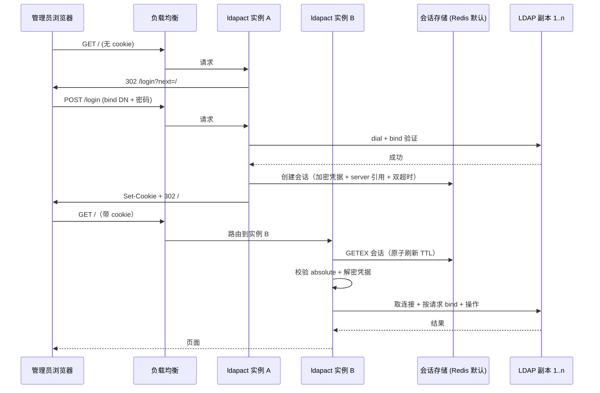

# External Session Store and Login Gate

## Summary

将会话存储抽象为可配置后端（Redis 默认，bbolt 与 memory 显式可选），并把共享管理员身份的登录门禁接入会话生命周期：bind 密码从配置移入登录流程，LDAP 验证通过后加密存入会话记录，任何实例都可凭该记录操作目录。多 server 以同目录副本 failover 落地（`LDAPADM_SERVERS` 列表 + `LDAPADM_URL` 单 server 兼容）。实现上以"存储接口 + 三个后端 + 凭据加密 + 无绑定连接池按请求绑定 + 登录/登出 + 副本 failover + 配置接线"八个实施单元推进，安全不变量（`__Host-` cookie、CSRF、审计 actor、日志红act）全部保留。

---

## Problem Frame

当前会话存储在本地 bbolt 单文件（`pkg/session`），多实例部署下各实例 session 互不可见，会话层事实上不可用；bind 密码长期放在配置里（`LDAPADM_BIND_PASSWORD`），能读取配置的人即可管理员操作；连接池在启动时以配置身份 fail-fast 绑定，不支持多副本地址，也不支持按会话身份执行。本次改动同时解决共享会话、登录门禁、凭据归属与副本 failover 四个缺口。

---

## Requirements

以下 R-IDs 直接对应 origin 文档（`docs/brainstorms/2026-08-31-external-session-store-and-login-gate-requirements.md`），每条标注覆盖的实施单元。

- R1. 会话存储抽象为可配置后端：Redis（默认）、bbolt（非默认兼容）、memory（可选）。→ U1, U2, U3
- R2. Redis 后端记录 server 引用、bind DN、加密凭据与双超时；跨实例并发读写；原子轮换；过期清理。→ U3
- R3. bbolt/memory 保持既有语义（双超时、轮换、清理）；memory 重启即清空；两者仅面向单实例。→ U1
- R4. 会话过期或登出后，其中携带的凭据不得再用于 LDAP 操作。→ U3, U6
- R5. 登录门禁：共享管理员身份；bind DN 由配置预填、可编辑；密码由登录者输入，不再来自配置。→ U6
- R6. 登录验证以提交的 bind DN + 密码对可用副本执行 LDAP bind；成功后将凭据加密存入会话记录；凭据绝不写入 cookie、日志或页面。→ U5, U6
- R7. 登出：删除会话记录并清空 cookie。→ U6
- R8. 会话过期默认行为改为跳转登录页（redirect_to_login），retry_bind 移除；运行期 invalidCredentials 作废会话并引导重新登录。→ U2, U6
- R9. 登录、登出路由受既有安全中间件保护（CSRF、速率限制、安全头、请求 ID）。→ U6
- R10. 配置支持 `LDAPADM_SERVERS`（[]string 逗号分隔），共享 baseDN/treeFilter/bindDN；不引入按 server 的并行参数列表。→ U2, U7
- R11. 连接池在副本间故障转移；副本故障对用户透明；全部不可达时给出明确错误。→ U7
- R12. 登录表单不提供 server 选择器；副本对用户透明。→ U6
- R13. 保留 `__Host-` cookie 属性、CSRF Origin 校验、审计 actor=bind DN、密码/凭据日志红act。→ U6
- R14. 多实例正确性：旋转、过期、登出在任意实例生效，无需会话亲和性；所有实例持有同一凭据解密密钥。→ U2, U3, U6
- R15. 启动不再需要 bind 密码；目录可达性/TLS 探测保留，凭据校验移至首次登录。→ U5, U8
- R16. 配置校验：副本列表非空且 URL 合法；未知 `LDAPADM_*` 忽略、必填缺失启动失败的既有规则继续适用；存储后端、Redis 连接、凭据加密密钥均有明确配置项。→ U2, U8
- R17. bbolt 后端下 `LDAPADM_DB_PATH` 继续有效；不迁移既有会话。→ U1, U8

**Origin actors:** A1 管理员/运维操作者, A2 平台运维, A3 LDAP 目录
**Origin flows:** F1 登录（含过期重登）, F2 跨实例会话复用, F3 过期与登出, F4 副本 failover
**Origin acceptance examples:** AE1 跨实例共享（R1, R14）, AE2 idle 过期跳登录（R4, R8）, AE3 登出后重放被拒（R7）, AE4 副本 failover（R10, R11）, AE5 目录改密强制重登（R6, R8）, AE6 错误密码受限速（R5, R6）, AE7 memory 重启清空/bbolt 持久（R1, R3）

---

## Scope Boundaries

- PG/memcached 后端——延后，待真实需求（origin Scope Boundaries 携带）。
- 无状态签名 cookie 会话——否决：bind 凭据需共享且可撤销，cookie 无法承载（origin 携带）。
- per-user bind 与多租户/公网暴露模型——延后；保持共享身份（origin 携带）。
- 不同目录的多 profile 配置与登录页 server 选择器——延后（origin 携带）。
- F2 向导的服务端会话状态行为——延后；会话数据字段保留但不新增行为（origin 携带）。
- 既有 bbolt 会话迁移——不做，会话短生命周期（origin 携带）。
- 双密钥优雅轮换、Redis cluster/sentinel 客户端模式、按凭据缓存连接池——本计划明确排除（见 Deferred to Follow-Up Work）。

### Deferred to Follow-Up Work

- 凭据加密密钥双密钥优雅过渡：本计划只支持单密钥，换密钥 = 全部会话失效（短生命周期会话可接受）。独立迭代。
- Redis HA 客户端模式（cluster/sentinel）与 Redis 侧监控：Redis 本身的运维归平台，本计划只做单节点 URL + 可选 TLS。
- 按凭据缓存小型连接池（性能优化）：v1 采用每请求 bind，观察真实开销后再决定是否缓存。
- per-user bind 与多目录 profile：需要新的认证模型与登录 UI，独立 brainstorm。

---

## Context & Research

### Relevant Code and Patterns

- `pkg/session`：`Store`（bbolt 实现）、`Value`（CreatedAt/LastSeenAt/ExpiresAt/AbsoluteExpiresAt/ProfileRef/Data）、cookie 的 `__Host-` 规则与 256-bit ID、`Rotate`、`SweepLoop`；测试用时钟注入（`SetNow` / `s.now`）。
- `pkg/authn`：`Middleware`（ensure/newSession/handleExpired/rotate、session context、healthz/static 跳过、nil store 直通）、`CSRF`（Origin 校验）。
- `internal/app/app.go`：中间件链顺序（recover → request id → secheaders → session → csrf → ratelimit → routes）、`entryDispatch`/`treeDispatch` 的多段通配符手动分发、`sessOpts.Profile = d.Cfg.LDAP.BindDN` 接线。
- `pkg/config`：扁平 `envFields` + `LDAPADM` 前缀（刻意避免嵌套结构）、`passwordScheme` 自定义 Decoder 先例、`ResolveSecret` 链（env → 0600 文件 → TTY）、`validateLDAP`/`validateSession` 的 fail-fast 校验、`-config-help` 自动生成配置参考。
- `pkg/ldapx`：手写 channel 连接池（`PoolOptions`、启动 fail-fast 绑定、30s 健康循环、validate-on-Put、`Do` 对可重试网络错误重试一次）、`Client`（pool + autoPool + schema 缓存）。
- `pkg/web`：`Renderer.Page`（全页）/`Fragment`（HTMX 局部），模板嵌入 `pkg/web/templates`。
- `internal/testldap`：LDAP 测试后端探测顺序（env → testcontainers → 本地 slapd），不可用时跳过（`ErrUnavailable`），固定 fixture 身份。
- `pkg/session/store_test.go`、`pkg/authn/middleware_test.go`、`pkg/config/config_test.go`：既有测试模式（时钟注入、TestEnvTagsMatchConstants、中间件 httptest 链）。

### Institutional Learnings

- `docs/plans/2026-08-24-001-feat-ldapact-v1-implementation-plan.md`：KTD 7/8 选 bbolt + 0600 权限 + 5 分钟 sweeper；OWASP 驱动 absolute timeout 与 `__Host-` 前缀；session store 选型原本就是"Deferred to Planning"。
- `docs/plans/2026-08-26-002-refactor-envconfig-config-migration-plan.md` 与 CHANGELOG（2026-08-31）：刚完成 envconfig 扁平化迁移，明确保持扁平 `LDAPADM_*` 命名、默认值唯一来源在 `Validate()`、未知变量忽略、set-but-empty 行为；`LDAPADM_SERVERS` 用 []string 与这套约定一致。
- `docs/brainstorms/ldapact-go-reimplementation.md`：v1 认证形态假设"单 bind + 服务端 session"，公网暴露才重写 per-user bind；本次登录门禁不推翻该假设（仍是共享身份）。
- `OPERATIONS.md`/`README.md`：sessions.db 生命周期、secret 解析示例、`LDAPADM_*` 配置表都随本次改动需要更新。

### External References

- go-redis v9（`github.com/redis/go-redis/v9`）：标准 Go Redis 客户端；连接池需配置 `IdleTimeout`/`ConnMaxLifetime` 避免 TIME_WAIT 堆积。
- Redis 会话存储模式：滑动 TTL（每次读写刷新）+ 值内绝对过期字段；`GETEX` 原子读并刷新；`RENAME` 原子轮换；TTL 自动过期替代 sweeper。
- OWASP Session Management Cheat Sheet：服务端 opaque ID + Redis 存储便于撤销；状态变更后轮换 session ID。
- 凭据静态加密：AES-256-GCM + 每记录 nonce + 独立密钥管理（密钥不与应用代码/配置同存）。

---

## Key Technical Decisions

- **后端选择**：`LDAPADM_SESSION_STORE=redis|bbolt|memory`，默认 `redis`；工厂按配置构造，接口统一为 Create/Get/Rotate/Delete/Sweep/Close。bbolt 与 memory 仅单实例，Redis 面向多实例。
- **凭据加密边界**：存储层只持久化不透明加密字节；AES-256-GCM 封装在会话层（envelope = 版本字节 + 12 字节 nonce + 密文+tag），密钥经既有 `ResolveSecret` 链（`LDAPADM_SESSION_KEY`，base64 32 字节）。中间件在写入前加密、读取后解密并仅挂到请求 context。
- **Redis 键模型**：每个会话一个键（`ldapa_sess:<id>`），值为 JSON 序列化的会话记录（含加密凭据、server 引用、双超时字段）。TTL = min(剩余 idle, 剩余 absolute)，读取用 `GETEX` 原子刷新；absolute 过期以值内时间戳为准（惰性删除）；轮换用 `RENAME`（原子）；`Sweep` 为 no-op（TTL 自动清理）。
- **无绑定连接池 + 按请求绑定**：主连接池不再在启动时绑定配置身份；每次 LDAP 操作从池取连接后，用请求 context 里的会话凭据 bind，再执行操作。auto-number 池保持启动时绑定不变。无绑定池的健康检查降级为拨号级（dial + TLS 校验），不再做匿名 base 搜索。被否决方案：按凭据缓存小型连接池——凭据生命周期与 LRU 管理复杂、跨实例共享困难，管理工具每请求一次 bind 的开销可接受（见 Risks），缓存作为 Follow-Up。
- **副本 failover**：每个副本一个无绑定子池；`Do` 以轮转起点遍历副本，仅对网络级可重试错误跨副本重试；`invalidCredentials`（49）绝不 failover（同目录共享身份，换副本结果相同），直接进入强制重登流程。跨副本重试有上限，避免雪崩。被否决方案：单池内混用多 URL——健康状态与绑定身份耦合、故障隔离差，无法独立标记副本健康。
- **中间件语义变化**：公开路径 `/healthz`、`/static/*`、`/login` 跳过认证；其余请求无有效会话一律 302 → `/login?next=...`；不再为每个匿名请求铸造 session（原 AE1 auto-login 行为被登录门禁取代）；状态变更请求的轮换保留凭据随记录迁移；过期/缺失 → 清 cookie + 重定向。
- **`LDAPADM_URL` 兼容**：保留为单 server 入口；`LDAPADM_SERVERS` 设置时优先，两者同时设置 → 启动报错；均未设置 → 启动报错。
- **过期动作翻转**：`session.expired_action` 默认值从 `retry_bind` 改为 `redirect_to_login`，`retry_bind` 从允许值中移除（配置校验拒绝）。
- **启动语义**：`ResolveSecrets` 不再要求 `LDAPADM_BIND_PASSWORD`（变为可选/废弃），新增 `LDAPADM_SESSION_KEY` 必填；目录侧只保留拨号/TLS 可达性探测，凭据校验移到首次登录。
- **invalidCredentials 处理**：`pkg/ldapx` 返回类型化 LDAP 错误；`pkg/authn` 提供统一的"作废会话 + 清 cookie + 重定向登录"助手，entry/tree/search/ldif 的错误路径统一走该助手。

---

## Open Questions

### Resolved During Planning

- Redis 双超时表示：TTL 滑动 + 值内 absolute 字段 + `GETEX` 原子刷新（origin Deferred #1）。
- 配置项命名：`LDAPADM_SESSION_STORE`、`LDAPADM_REDIS_URL`、`LDAPADM_REDIS_PASSWORD`（secret）、`LDAPADM_REDIS_DB`、`LDAPADM_SESSION_KEY`（secret）、`LDAPADM_SERVERS`（[]string）（origin Deferred #3）。
- 密钥轮换：v1 单密钥；换密钥 = 全部会话失效，作为已知取舍记录（origin Deferred #2 部分解决）。
- failover 算法：轮转起点 + 网络级错误跨副本重试 + 上限；49 不 failover（origin Deferred #4）。
- bbolt 兼容：`LDAPADM_DB_PATH` 仅在选择 bbolt 后端时生效（origin Deferred #5）。
- Redis 集成测试后端顺序：env 覆盖 → 本地 `redis-server` 二进制（临时实例）→ testcontainers → 跳过（镜像 `internal/testldap`；用户确认"本地优先"）。

### Deferred to Implementation

- `GetData`/`SetData` 是否保留在接口之外：当前无调用方，接口不暴露；若 F2 向导后续需要，再以数据字段 + 后端方法扩展（不改变存储格式）。
- Redis 连接池参数（`IdleTimeout`/`ConnMaxLifetime` 等）的具体取值：按部署负载在实现时确定。
- 登录页最终视觉与 a11y 细节：沿用既有 WCAG 2.1 AA 模板模式，样式在实现时打磨。

---

## High-Level Technical Design

> *This illustrates the intended approach and is directional guidance for review, not implementation specification. The implementing agent should treat it as context, not code to reproduce.*



存储接口的形态（方向性）：

```text
Store (interface)
  Create(id, profileRef, serverRef, encryptedCredential) -> Value   // 盖章时间戳
  Get(id)          -> Value      // 校验双超时；Redis 用 GETEX 刷新 TTL
  Rotate(old, new) -> Value      // bbolt: 迁移+删旧；Redis: RENAME；memory: 同 bbolt
  Delete(id)                     // 登出/过期
  Sweep()                        // bbolt/memory 清理；Redis no-op
  Close()
Backends: bbolt (现有) | memory (新增) | redis (新增, go-redis v9)
```

请求侧凭据流（方向性）：

```text
authn.Middleware
  public: /healthz /static/* /login  -> 直通
  无 cookie                          -> 302 /login
  cookie 有效                        -> Get -> 解密凭据 -> 挂到 request context
  过期/缺失                          -> 清 cookie + 302 /login
  状态变更                           -> Rotate 后进 handler

ldapx（每请求）
  Do(ctx, fn): 取无绑定连接 -> 用 ctx 会话凭据 bind -> fn -> Put
  49 invalidCredentials              -> 交给 authn 助手：Delete + 清 cookie + 302 /login
  网络级错误                          -> 下一个副本重试（上限内）
```

---

## Implementation Units

### U1. 会话存储接口 + bbolt/memory 后端

**Goal:** 把 `pkg/session` 的 bbolt 存储抽象成接口，抽出共享的过期/轮换语义，新增 memory 后端；`Value` 扩展出 server 引用与加密凭据字段（格式兼容扩展）。

**Requirements:** R1, R3, R17, AE7

**Dependencies:** None

**Files:**
- Modify: `pkg/session/session.go`、`pkg/session/rotation.go`、`pkg/session/sweep.go`、`pkg/session/store_test.go`
- Create: `pkg/session/memory.go`、`pkg/session/memory_test.go`
- Test: `pkg/session/store_test.go`、`pkg/session/memory_test.go`

**Approach:**
- 定义 `Store` 接口（Create/Get/Rotate/Delete/Sweep/Close），`Create` 增加 server 引用与加密凭据入参；bbolt 实现保留（含 0600 模式检查、父目录创建、sweeper），`GetData`/`SetData` 保留为 bbolt 附加方法但不进接口。
- `Value` 增加 `ServerRef string` 与 `Credential []byte`（JSON omitempty），既有字段不动。
- 抽出共享过期判定（idle/absolute）与轮换语义复用点；memory 后端用互斥 map，Sweep 复用同一套清理逻辑，重启即清空。
- 保持 `SweepLoop` 共享。
- 调用方类型迁移（`entry.New` 参数、`app.Deps.Store`、`main` 构造点）推迟到 U6/U8 完成；本单元结束时 bbolt 具体类型实现新接口，既有调用方保持编译通过。

**Patterns to follow:**
- `pkg/session/store_test.go` 的时钟注入与既有测试矩阵；bbolt 的 0600/父目录校验逻辑。

**Test scenarios:**
- Happy path: bbolt 与 memory 均能 Create → Get → Rotate → Delete，字段（profile/server/credential）完整往返；AE7：memory 重启后（新实例）Get 返回缺失，bbolt 持久。
- Edge case: 空 credential、超长 DN；两个后端并发 Create/Get 同一 ID 不崩溃。
- Error path: Get 缺失返回 `ErrSessionMissing`；过期返回 `ErrSessionExpired` 且记录被清理；Rotate 缺失旧 ID 报错。
- Integration: memory/bbolt 的轮换后旧 ID 失效、新 ID 可用（语义一致性）。

**Verification:** 既有 bbolt 测试全绿；memory 与 bbolt 通过同一套行为断言；`go test ./pkg/session/` 通过。

---

### U2. 配置面：存储选择、Redis 连接、副本列表与过期动作翻转

**Goal:** 新增/调整 `LDAPADM_*` 配置项与校验：`LDAPADM_SESSION_STORE`、`LDAPADM_REDIS_URL`/`_PASSWORD`/`_DB`、`LDAPADM_SESSION_KEY`（secret）、`LDAPADM_SERVERS`（[]string）与 `LDAPADM_URL` 兼容规则；过期动作默认翻转；`LDAPADM_BIND_PASSWORD` 变为可选。

**Requirements:** R1, R8, R10, R14, R16, AE4

**Dependencies:** None（配置独立于存储实现；secret 解析复用现有链）

**Files:**
- Modify: `pkg/config/config.go`、`pkg/config/secret.go`、`pkg/config/config_test.go`、`pkg/config/decoder.go`（如需新 Decoder）
- Test: `pkg/config/config_test.go`

**Approach:**
- 扁平 `envFields` 增加字段；`LDAPADM_SERVERS` 用 `[]string`（envconfig 逗号分隔，已验证 v1.4.0 支持）。
- `ResolveSecrets` 改为：必填 `LDAPADM_SESSION_KEY`；`LDAPADM_BIND_PASSWORD` 不再解析（废弃文档化）；auto-number 密码条件解析不变。
- `validateSession`：store 枚举校验；Redis 配置仅在选择 redis 时校验 URL 合法（redis:// 或 rediss://，TLS 校验强制）；过期动作默认 `redirect_to_login`，`retry_bind` 从允许值移除。
- `validateLDAP`：SERVERS 与 URL 冲突规则（SERVERS 优先；同设报错；均缺报错）；副本列表逐项 URL 校验。
- 新增配置参考（`-config-help` 自动生成）与 `config_test.go` 的常量-标签一致性测试扩展。

**Patterns to follow:**
- `pkg/config/config_test.go` 的 `TestEnvTagsMatchConstants`、`TestLoadShippedEnvNames`、set-but-empty 行为测试；`passwordScheme` Decoder 先例。

**Test scenarios:**
- Happy path: 全量新配置解析正确；仅 `LDAPADM_URL` 时兼容单 server；仅 `LDAPADM_SERVERS=a,b` 时解析为两个副本。
- Edge case: `LDAPADM_SERVERS` 空元素/空串；URL 与 SERVERS 同时设置；store=memory 时 Redis 配置可缺省。
- Error path: 无效 store 值报错；无效副本 URL 报错；`retry_bind` 被拒绝；缺少 `LDAPADM_SESSION_KEY` 启动失败（secret 链失败）。
- Integration: `-config-help` 输出包含全部新变量名。

**Verification:** `go test ./pkg/config/` 全绿；`LDAPADM_*` 参考文档与测试枚举一致。

---

### U3. Redis 会话后端

**Goal:** 新增 `pkg/session` 的 Redis 实现：JSON 记录、滑动 TTL + absolute 强制、`GETEX` 原子刷新、`RENAME` 原子轮换、TTL 自动过期；跨实例共享语义（AE1）。

**Requirements:** R1, R2, R4, R14, AE1

**Dependencies:** U1, U2

**Files:**
- Modify: `go.mod`、`go.sum`（新增 `github.com/redis/go-redis/v9`；测试新增 `github.com/alicebob/miniredis/v2`）
- Create: `pkg/session/redis.go`、`pkg/session/redis_test.go`、`pkg/session/redis_integration_test.go`、`pkg/session/testredis.go`（本地 Redis 测试后端探测助手，镜像 `internal/testldap` 模式）
- Test: `pkg/session/redis_test.go`、`pkg/session/redis_integration_test.go`

**Approach:**
- 键命名空间 `ldapa_sess:<id>`；值 JSON 序列化 `Value`；TTL = min(剩余 idle, 剩余 absolute)；`GETEX` 原子刷新；absolute 以值内时间戳强制；`RENAME` 轮换（保留 TTL）；`Sweep` no-op。
- 客户端由 `LDAPADM_REDIS_URL` 构造；`rediss://` 强制 TLS 校验；密码走 secret（不落 URL/日志）；`LDAPADM_REDIS_DB` 选库。
- 连接池参数按外部研究建议配置（`IdleTimeout`、`ConnMaxLifetime`）。
- 单元测试用 miniredis（快速、进程内）。
- 集成测试后端探测顺序（用户确认本地优先，镜像 `internal/testldap`）：1) `LDAPADM_TEST_REDIS_URL` 调用方提供的专用测试实例；2) 本地 `redis-server` 二进制——临时目录数据目录、随机 127.0.0.1 端口的前台实例，绝不读写系统配置；3) testcontainers 容器；4) 不可用时跳过。验证两个 Store 实例共享同一 Redis 的跨实例语义（AE1）。

**Patterns to follow:**
- `internal/testldap` 的后端探测/跳过模式与安全契约（临时数据目录、随机端口、Stop 清理）；`pkg/session/store_test.go` 的时钟注入（Redis 实现用可注入时钟校验 absolute）。

**Test scenarios:**
- Happy path: Create → Get 往返（含加密凭据字节）；Get 刷新滑动 TTL（时钟前推验证不过期）；RENAME 轮换后旧 ID 失效新 ID 可用；Delete 后缺失。
- Edge case: TTL 边界（恰等于 idle/absolute）；超大值（长 DN + 凭据）往返。
- Error path: 键缺失/过期返回 `ErrSessionMissing`/`ErrSessionExpired`；Redis 不可达时操作返回类型化错误（不 panic）；`RENAME` 目标已存在（碰撞，理论不可达）报错。
- Integration: AE1——两个 Store 指向同一 Redis，一个写一个读；并发 Get/Rotate 同一 ID 不产生双活会话（原子语义）。

**Verification:** `go test ./pkg/session/` 全绿（含 miniredis 单元 + 门禁集成）；`go vet ./pkg/session/` 通过。

---

### U4. 会话凭据加密（cipher）

**Goal:** 提供 AES-256-GCM 的会话凭据加密封装：版本化 envelope、每记录 nonce、错误分类（损坏/密钥不符），密钥来自 `LDAPADM_SESSION_KEY` secret。

**Requirements:** R6, R13, R14, AE5

**Dependencies:** U2（密钥配置）

**Files:**
- Create: `pkg/session/credential.go`、`pkg/session/credential_test.go`
- Test: `pkg/session/credential_test.go`

**Approach:**
- envelope = 版本字节 + 12 字节随机 nonce + AES-256-GCM 密文与 tag；密钥要求 base64 解码为 32 字节（过弱/格式错误在启动时拒绝）。
- 解密失败分类：格式损坏 vs 密钥不符；密钥不符按"会话无效 → 重登"处理（R14 换密钥语义），并记录脱敏审计事件（不包含密文）。
- 加解密函数与 store 解耦：中间件在 Create 前加密、Get 后解密。

**Patterns to follow:**
- `pkg/config/secret.go` 的密钥解析与红act（`SecretFingerprint`）；`golang.org/x/crypto` 已依赖。

**Test scenarios:**
- Happy path: 加解密往返；两次加密同一明文产生不同密文（随机 nonce）。
- Edge case: 空明文；最大长度（长 DN + 密码）往返。
- Error path: 篡改密文任一字节解密失败；错误密钥解密失败并返回可区分错误；截断/非法 envelope 报"格式损坏"。
- Integration: 加密凭据经 U3 Redis 存储往返后可解密（AE5 前置）。

**Verification:** `go test ./pkg/session/ -run Credential` 全绿；解密错误可区分且不泄露内容。

---

### U5. LDAP 池：无绑定模式 + 按请求绑定 + 登录验证助手

**Goal:** 重构 `pkg/ldapx`：主池支持无绑定连接，每次操作按请求 context 中的会话凭据 bind；健康检查降级为拨号级；提供登录验证（dial + bind + 关闭）助手；invalidCredentials 类型化。

**Requirements:** R6, R15, AE5

**Dependencies:** None（供 U6/U7 使用）

**Files:**
- Modify: `pkg/ldapx/pool.go`、`pkg/ldapx/client.go`、`pkg/ldapx/bind.go`、`pkg/ldapx/errors.go`、`pkg/ldapx/pool_test.go`、`pkg/ldapx/integration_test.go`
- Test: `pkg/ldapx/pool_test.go`、`pkg/ldapx/integration_test.go`

**Approach:**
- `PoolOptions.BindDN/BindPassword` 变为可选：为空时连接不 bind（无绑定模式）；`Do` 在 fn 前用请求凭据 bind（凭据从 context 读取，由 U6 中间件注入）。
- 无绑定池的健康检查只做 dial/TLS 探测，不再匿名 base 搜索（避免目录拒绝匿名搜索导致误判）。
- 新增"按给定 DN/密码验证"助手（登录用）：拨号（含 TLS 校验）→ bind → 关闭，成功返回 nil；49 映射为类型化错误。
- `ldapx.Client` 启动不再需要配置密码绑定；`New` 保留拨号可达性/TLS 探测（R15），auto-number 池维持绑定模式。

**Patterns to follow:**
- 现有 `Pool.Do` 重试语义（仅网络级可重试错误）、`isRetryable`、`pkg/ldapx/errors.go` 类型化错误。

**Test scenarios:**
- Happy path: 无绑定池取连接 → 用注入凭据 bind → 操作成功；验证助手对正确凭据返回成功。
- Edge case: 空凭据（匿名）路径；绑定后连接归还校验。
- Error path: 错误凭据返回 49 且不重试；网络不可达返回类型化错误；无绑定池健康检查不因匿名搜索失败误报。
- Integration: 对 `internal/testldap` 实例：验证助手正确/错误密码两路；按请求 bind 的完整操作路径（AE5 前置）。

**Verification:** `go test ./pkg/ldapx/` 全绿；集成测试对测试后端验证 bind 行为。

---

### U6. 认证中间件改造 + 登录/登出 + 路由

**Goal:** 登录门禁落地：中间件不再为匿名请求铸造会话（302 → /login），过期动作改为重定向；新增登录页（bind DN 预填可编辑 + 密码）、登录验证与会话创建、登出；invalidCredentials 统一走"作废会话 + 重登"；模板与路由接入。

**Requirements:** R4, R5, R6, R7, R8, R9, R12, R13, AE2, AE3, AE5, AE6

**Dependencies:** U1, U2, U4, U5

**Files:**
- Modify: `pkg/authn/middleware.go`、`pkg/authn/middleware_test.go`、`internal/app/app.go`、`pkg/entry/handlers.go`、`pkg/tree/*`、`pkg/search/*`、`pkg/ldif/*`（invalidCredentials 助手接线）
- Create: `pkg/authn/login.go`、`pkg/authn/login_test.go`、`pkg/web/templates/login.html`、`internal/app/app_test.go`
- Test: `pkg/authn/middleware_test.go`、`pkg/authn/login_test.go`、`internal/app/app_test.go`

**Approach:**
- 中间件：公开路径集合 = `/healthz`、`/static/*`、`/login`；其余请求无 cookie 或会话失效 → 清 cookie + 302 `/login?next=...`；有效会话 → 解密凭据 → 挂 request context；状态变更轮换保留凭据（走 U1 的 Rotate）。
- 登录：GET `/login` 渲染表单（bind DN 从配置预填、可编辑，无 server 选择器）；POST `/login` 用 U5 验证助手对副本验证，成功则 Create 会话（profileRef=提交的 DN、serverRef、加密凭据）并 Set-Cookie，302 到 next；失败渲染错误（不创建会话）。
- 登出：POST `/logout`（CSRF 保护）→ Delete + 清 cookie → 302 `/login`。
- invalidCredentials 助手：entry/tree/search/ldif 的错误路径统一调用（Delete + 清 cookie + 302），至少一条变更路径（如改密）用集成测试证明 AE5。
- 登录/登出路由在 `internal/app` 注册；页面模板走 `Renderer.Page`；POST 均受既有中间件链（CSRF/限速/安全头）保护。

**Patterns to follow:**
- `pkg/authn/middleware_test.go` 的 httptest 中间件链测试；`internal/app/app.go` 的路由注册与 `entryDispatch` 分发；`pkg/web/templates` 现有模板与 WCAG 模式。

**Test scenarios:**
- Happy path: 无 cookie 访问首页 302 到 /login；登录成功 → Set-Cookie + 302；带 cookie 访问通过；登出 → cookie 清空 + 重定向（AE3）。
- Edge case: next 参数回跳；bind DN 编辑后按提交值验证；/login 与 /static、/healthz 不受门禁影响。
- Edge case: 已登录用户访问 /login 的行为（重定向回首页或展示已登录状态）；已有会话时 POST /login（轮换后重新登录）。
- Error path: 错误密码 → 不创建会话 + 渲染错误（AE6）；连续失败受速率限制（现有 ratelimit 覆盖）；过期会话 → 重定向（AE2）；无效 cookie → 400/清 cookie。
- Integration: 登录 → 改密操作遇 49 → 会话作废 → 重定向登录，新密码可重登（AE5）。

**Verification:** `go test ./pkg/authn/ ./internal/app/` 全绿；手动 curl 冒烟登录/登出/过期三态。

---

### U7. 副本 failover（多 URL 池）

**Goal:** 基于 `LDAPADM_SERVERS` 构建副本感知的连接层：每副本子池、轮转起点、网络级错误跨副本重试（有上限）、invalidCredentials 不 failover。

**Requirements:** R10, R11, AE4

**Dependencies:** U2, U5

**Files:**
- Create: `pkg/ldapx/replica.go`、`pkg/ldapx/replica_test.go`
- Modify: `pkg/ldapx/client.go`、`pkg/ldapx/pool.go`、`pkg/ldapx/integration_test.go`
- Test: `pkg/ldapx/replica_test.go`、`pkg/ldapx/integration_test.go`

**Approach:**
- 副本层持有 N 个无绑定子池；`Do` 从轮转起点开始，网络级可重试错误按序尝试下一副本，总尝试次数有上限（如 2×副本数）；49 直接返回不切换。
- 每个子池独立健康循环（拨号级）；全部不可达时返回聚合错误（列出各副本失败原因，便于诊断）。
- 登录验证助手同样走副本层（任一可用副本可验证）。

**Patterns to follow:**
- `Pool.Do` 的 `isRetryable` 判定；`pkg/ldapx/errors.go` 的错误类型。

**Test scenarios:**
- Happy path: 主副本正常时操作成功；主副本网络失败 → 自动切到第二副本成功（AE4 前段）。
- Edge case: 轮转起点在不同请求间变化（避免热点）；副本数与上限边界。
- Error path: 全部副本不可达 → 聚合错误含各副本原因（AE4 后段）；错误凭据 49 → 不切换副本、直接报错。
- Integration: 两个测试后端实例（同目录语义），一个停止后操作仍成功。

**Verification:** `go test ./pkg/ldapx/` 全绿；集成测试覆盖单副本故障切换。

---

### U8. 启动接线 + 文档/运维 + CHANGELOG

**Goal:** 组装：main/app 按配置选择后端与密钥解析、目录可达性探测、副本列表传入；README/.env.example/OPERATIONS 更新；每个实施单元一条 CHANGELOG。

**Requirements:** R15, R16, R17；全量回归

**Dependencies:** U1-U7

**Files:**
- Modify: `cmd/ldapact/main.go`、`internal/app/app.go`、`README.md`、`OPERATIONS.md`、`.env.example`、`CHANGELOG.md`
- Create: `internal/app/app_test.go`
- Test: `cmd/ldapact/main_test.go`（轻量冒烟）、`internal/app/app_test.go`

**Approach:**
- main：按 `LDAPADM_SESSION_STORE` 构造 Store（工厂），解析 `LDAPADM_SESSION_KEY`，不再要求 bind 密码；目录探测仅拨号/TLS；`LDAPADM_SERVERS`/`LDAPADM_URL` 合并为副本列表传给 `ldapx.New`。
- app：中间件链不变，Profile/ExpiredAction 接线更新；登录/登出路由已在 U6 注册。
- 文档：README 配置表新增/更新（含 `LDAPADM_SESSION_STORE`/Redis/SERVERS/SESSION_KEY、expired_action 默认翻转、BindPassword 废弃说明）；OPERATIONS 增加会话存储生命周期（Redis 键与 TTL、密钥管理 0600、多实例共享、副本 failover 与排障）；`.env.example` 同步。
- CHANGELOG：按 U1-U8 每个实施单元一条。

**Patterns to follow:**
- `cmd/ldapact/main.go` 现有启动顺序（config → logger → ldapx → store → server）；README 配置表格式；CHANGELOG 单条每单元惯例。

**Test scenarios:**
- Happy path: 完整配置（Redis store + SERVERS + SESSION_KEY）启动成功并 serve。
- Edge case: store=bbolt 时 `LDAPADM_DB_PATH` 生效（R17）；store=memory 时忽略 DBPath。
- Error path: 缺 SESSION_KEY 启动失败；Redis 不可达启动失败（fail-fast）；SERVERS 与 URL 冲突启动失败；全部副本不可达时健康探测失败。
- Integration: 全链路冒烟——启动 → 登录 → 树浏览 → 登出（对测试后端）。

**Verification:** `make test`（单元 + 门禁集成）全绿；`make lint` 通过；README 配置表与 `-config-help` 一致；CHANGELOG 与 U1-U8 对应。

---

## System-Wide Impact

- **Interaction graph:** 影响 `pkg/authn.Middleware`（认证语义）、`pkg/session.Store`（所有调用方：authn、entry、main）、`pkg/ldapx`（池与 Client 构造）、`internal/app`（路由与接线）、`pkg/entry/tree/search/ldif`（错误路径接入 invalidCredentials 助手）、`pkg/config`（env 面与校验）。
- **Error propagation:** 存储失败（Redis 不可达）→ 会话读取失败 → 既有 503 模式；LDAP 49 → 会话作废 + 重定向；网络级错误 → 副本重试 → 全部失败聚合错误。
- **State lifecycle risks:** 轮换必须迁移加密凭据（避免轮换后丢凭据导致强制重登）；Redis TTL 与值内 absolute 不一致时以 absolute 为准；密钥更换导致存量密文不可解密 → 按"会话无效"处理（勿 500）。
- **API surface parity:** `-config-help` 输出、README 配置表、`.env.example` 三处必须同步；`LDAPADM_BIND_PASSWORD` 废弃需文档化。
- **Integration coverage:** 跨实例共享（AE1）、改密强制重登（AE5）、副本切换（AE4）单靠单元测试无法证明，需 U3/U6/U7 的门禁集成测试。
- **Unchanged invariants:** `__Host-LDAPADM_SID` 属性、CSRF Origin 校验、审计 actor、日志红act、fail-fast 启动、TLS 校验、env-only 配置（不引入配置文件）——均不改变。

---

## Risks & Dependencies

| Risk | Mitigation |
|------|------------|
| Redis 不可用：启动或运行期会话读写失败 | 启动 fail-fast（与 R14 一致）；运行期按既有 503 模式；OPERATIONS 排障章节 |
| 凭据加密密钥泄露/轮换 | 密钥经 0600 文件或 env；日志只记指纹；换密钥 = 全部会话失效（短生命周期可接受）并写入文档 |
| 每请求 bind 的性能开销 | 管理工具流量低可接受；记录为 Follow-Up（按凭据缓存池）；文档说明 |
| 目录侧对频繁 bind 的审计/限流压力 | 每请求一次 bind 是登录门禁的固有形态；文档记录监控点（bind 频率），Follow-Up 缓存池可缓解 |
| bbolt 非默认后端也会落盘加密凭据 | 密文以 AES-256-GCM 加密、密钥独立于文件（0600）；文档明确该文件现在含加密凭据，备份/权限策略需覆盖 |
| 副本 failover 雪崩/无限重试 | 跨副本重试有上限；49 不重试；聚合错误含各副本原因 |
| Redis 集成测试环境不稳定 | 镜像 testldap 的可用性门禁：本地 `redis-server` 优先，其次 testcontainers，不可用即跳过 |
| miniredis 与真实 Redis 命令差异（GETEX/RENAME 语义） | 单元测试用 miniredis 覆盖行为；门禁集成测试对真实 Redis 验证跨实例与原子语义 |
| 中间件语义变化破坏现有自动化（原 AE1 自动铸造 session） | 变更集中在 U6 并全量跑 authn 测试；README 记录登录门禁行为 |

---

## Documentation / Operational Notes

- README：配置表（新增 `LDAPADM_SESSION_STORE`/`LDAPADM_REDIS_*`/`LDAPADM_SERVERS`/`LDAPADM_SESSION_KEY`，`LDAPADM_BIND_PASSWORD` 废弃说明，`expired_action` 默认翻转）、登录流程、副本 failover 行为。
- OPERATIONS：会话存储生命周期（Redis 键命名、TTL 语义、密钥管理与轮换影响、多实例共享要点）、副本 failover 排障、sessions.db 章节改写为按后端说明。
- `.env.example`：新变量样例（含注释说明 SERVERS 与 URL 二选一）。
- CHANGELOG：U1-U8 各一条。
- 无代码级接口兼容承诺：`pkg/session` 的导出面随 U1 变化，属内部包（`pkg/` 可被同仓库引用，外部无 Go 消费者承诺）。

---

## Sources & References

- **Origin document:** [docs/brainstorms/2026-08-31-external-session-store-and-login-gate-requirements.md](docs/brainstorms/2026-08-31-external-session-store-and-login-gate-requirements.md)
- Related code: `pkg/session`、`pkg/authn`、`pkg/ldapx`、`pkg/config`、`internal/app`、`cmd/ldapact`
- Related plans: `docs/plans/2026-08-24-001-feat-ldapact-v1-implementation-plan.md`、`docs/plans/2026-08-26-002-refactor-envconfig-config-migration-plan.md`
- External docs: OWASP Session Management Cheat Sheet；go-redis v9 文档；Redis 滑动 TTL/GETEX/RENAME 模式
